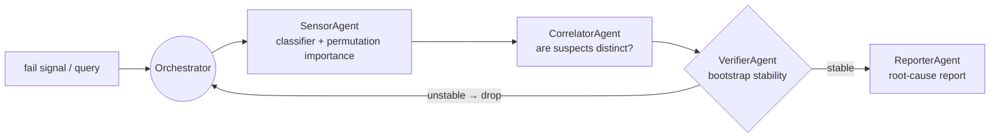

# Yield RCA Agent

**Multi-agent root-cause analysis for semiconductor yield loss.** Predicts wafer
fail from fab sensor data, then routes specialized agents — attribution,
correlation, verification — to trace *which* sensors actually drive the defect,
and reports the independent root-cause groups with a stability score.

Built to mirror a plan → execute → verify agent loop: suspects that don't
survive a bootstrap stability check are dropped before reporting.



## What it demonstrates
- **Agentic orchestration** — role-specialized agents (attribution / correlation /
  verification / reporting) with a verify-and-drop loop, not a single black-box score.
- **Explainable ML** — model-agnostic permutation importance; every suspect comes
  with an impact score *and* a stability score.
- **Handles the real pain** — high dimensionality, heavy class imbalance, and
  missing values (the SECOM problem shape).
- **Runs anywhere** — the offline path is pure NumPy; no GPU, no downloads, no API key.

## Results (synthetic benchmark, `demo_smoke.py`)
Injects 5 truly-causal sensors among 200, at an 8% fail rate, with block-correlated
noise so raw correlation alone can't find them.

| metric | value |
|---|---|
| classifier AUC | **0.998** |
| causal sensors recovered | **5 / 5** |
| false suspects after stability filter | 0 |

## Quickstart
```bash
pip install -r requirements.txt   # just numpy for the offline demo
python demo_smoke.py              # end-to-end on synthetic data
PYTHONPATH=. python tests/test_smoke.py
```

## Real data (UCI SECOM)
```python
from yieldrca import run_rca, load_secom
X, y, names = load_secom()        # 1567 wafers x 590 sensors (downloads ~1.5 MB)
out = run_rca(X, y, names)
print(out["report"])
```

## Production notes / scaling
- **Classifier** — the offline path is a class-weighted NumPy logistic regression;
  swap in gradient boosting (`xgboost`) + `shap` for production attribution
  (`requirements-full.txt`). The agent interface is model-agnostic.
- **Reporter** — set `OPENAI_API_KEY` to have an LLM write the narrative; otherwise
  a deterministic template is emitted.
- **MCP** — the agent tools (classifier, correlation, verification) are the natural
  seam to expose over MCP so an LLM planner can call them directly.

## Design
`yieldrca/` — `data.py` (SECOM + synthetic) · `model.py` (classifier + attribution)
· `agents.py` (Sensor / Correlator / Verifier / Reporter) · `pipeline.py` (orchestrator).

MIT licensed.
