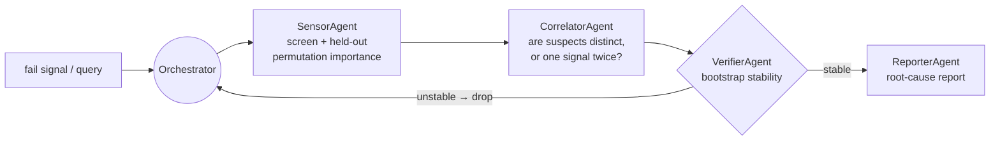

# Yield RCA Agent

**Multi-agent root-cause analysis for semiconductor yield loss, measured
honestly on real fab data.** A plan → execute → verify loop routes
role-specialized agents — attribution, correlation, verification, reporting —
over 590 process sensors to say *which* signals are implicated in wafer fail,
and how much that answer moves when you resample the wafers.

The interesting part of this repo is not that it produces a root-cause list.
It is that the list is scored against the obvious baseline under a protocol
that cannot flatter it, on the **UCI SECOM** dataset — 1,567 wafers, 590
sensors, 104 fails, missing values everywhere — and the result is largely
negative. That result is reported here in full.



The agents are deterministic tool users, not LLMs. Nothing in this repo calls a
model API; that keeps every number reproducible from a seed, and an LLM
narrating the same tool output would add prose rather than evidence.

<!-- BEGIN:headline -->
<!-- END:headline -->

Full tables, protocol and provenance: [`RESULTS.md`](RESULTS.md). Every figure
in this README and in `RESULTS.md` — and every comparative sentence built
around one — is generated by `scripts/report.py` from the JSON under `runs/`.
`scripts/report.py --check` fails CI if either file drifts from the JSON, so a
stale number cannot survive a commit.

## Two benchmarks, and the line between them

This distinction is the whole reason the results above can be trusted, so it is
stated before any of them:

| | **synthetic** (`demo_smoke.py`, `scripts/eval_synthetic.py`) | **real** (`scripts/eval_secom.py`) |
|---|---|---|
| data | generated: causal sensors planted among correlated decoys | UCI SECOM, as donated |
| ground-truth root causes | **yes, by construction** | **none exist** |
| what can be claimed | held-out AUC, top-5 stability, **and recovery of the planted causes** | held-out AUC and top-5 stability, **and nothing about causes** |

SECOM ships a pass/fail label and 590 anonymous sensor traces. It does not ship
an answer key, and no amount of attribution machinery creates one. So
"n/5 causal sensors recovered" is a claim this repo makes **only** on synthetic
data, and it is never carried over. A ranked SECOM suspect list is a
*hypothesis for an engineer to go test on the tool*, not a recovered cause.

<!-- BEGIN:kpi -->
<!-- END:kpi -->

<!-- BEGIN:dataset -->
<!-- END:dataset -->

## Handling the mess, inside the fold

Missing values, constant columns and duplicated sensors are not a preprocessing
footnote on SECOM — they are most of the problem, and the standard way to get a
too-good number is to resolve all three while looking at the whole dataset.
Every such decision here is a `fit` on the training fold:

- **Missing values.** Kept as `NaN` by the loader. Tree arms hand them to
  `HistGradientBoostingClassifier`, which splits on missingness natively; the
  other arms median-impute *per fold*. Because "the metrology step did not
  report" is itself a signal in a fab, `MissingIndicatorAppender` re-attaches a
  0/1 column for every sensor that has missing values in that fold, rather than
  letting the median erase it.
- **Constant columns.** Zero variance over the fold's observed values, so they
  carry nothing and make standardisation ill-posed. Dropped, with the reason
  recorded per column in `SensorCleaner.dropped_`.
- **Duplicated sensors.** Identical values *and* identical NaN pattern within
  the fold. Left in, one physical signal's importance is split across several
  identical names, which corrupts any top-k stability measurement before it
  starts.
- **Near-duplicates.** The harder case, and the common one here: sensors
  correlated above |r| = 0.99 without being identical. `CorrelatorAgent` groups
  them and reports one representative per group, and the stability KPI is
  reported both per sensor and per group so the effect of that choice is
  visible rather than baked in.

The count of what each rule removes is in the dataset table above, measured by
`scripts/prepare_data.py`.

<!-- BEGIN:secom_auc -->
<!-- END:secom_auc -->

<!-- BEGIN:sweep -->
<!-- END:sweep -->

<!-- BEGIN:stability -->
<!-- END:stability -->

<!-- BEGIN:synthetic -->
<!-- END:synthetic -->

## What to actually do with this

The measurements point at one configuration, and it is not the one that scores
best on a slide:

1. **Predict with every sensor.** Selection costs AUC monotonically on SECOM;
   the signal is diffuse. `rf_all` is the model to deploy.
2. **Report with the loop, and quote its stability.** `AgentRCA.report()`
   returns the ranked survivors with each one's bootstrap re-selection
   frequency. Used this way the loop costs nothing predictive — the AUC is the
   baseline's by construction — and the stability number is what stops the
   report being over-read.
3. **Believe the chronological split, not the shuffled one.** For a
   go/no-go decision on deploying a yield predictor, the shuffled-CV number is
   the optimistic one.
4. **Treat the suspect list as a work order, not a diagnosis.** At this
   stability, the useful output is a shortlist of signal *families* worth an
   engineer's afternoon.

The honest summary of the KPI card: on SECOM this pipeline is a decent
predictor and an unreliable attributor, and the agent loop's contribution is
explanatory rather than predictive.

## Leakage controls

| decision | where it is fitted |
|---|---|
| constant / duplicate sensor detection | `SensorCleaner.fit`, training fold |
| imputation medians | `SimpleImputer` inside the pipeline |
| standardisation | `StandardScaler` inside the pipeline |
| missing-indicator column choice | `MissingIndicatorAppender.fit`, training fold |
| candidate screen | `screen_*`, training fold |
| permutation importance | inner split of the training fold |
| bootstrap verification | resamples of the training fold only |
| baseline hyperparameters | inner-CV `GridSearchCV`, training fold |
| correlation clusters (reporting only) | unlabelled sensor matrix, never used to predict |

`tests/test_real.py::test_permuted_labels_score_at_chance` is the enforcement:
it shuffles the labels, runs the full cross-validation, and asserts every arm
lands near 0.5. Any decision that had escaped the fold would show up there as
skill on noise.

## Quickstart

The offline path needs nothing but numpy:

```bash
pip install -r requirements.txt
python demo_smoke.py                          # synthetic, end-to-end
PYTHONPATH=. python tests/test_smoke.py
```

The real-data path adds pandas / scikit-learn / scipy:

```bash
pip install -r requirements-full.txt
python scripts/prepare_data.py                # unpack secom.zip -> data/
bash scripts/overnight.sh $(which python)     # every experiment, then the report
```

`scripts/overnight.sh` runs on CPU, caps parallelism at 16 workers and pins one
BLAS thread per worker. Individual stages:

```bash
python scripts/eval_secom.py      --repeats 5 --jobs 16   # baselines vs the loop
python scripts/sweep_loop.py      --repeats 2 --jobs 16   # loop sensitivity
python scripts/stability_secom.py --boot 200 --jobs 16    # the top-5 KPI
python scripts/eval_synthetic.py  --seeds 10 --jobs 10    # ground-truth recovery
python scripts/report.py                                  # RESULTS.md + README
```

Using the loop directly:

```python
from yieldrca.data import load_secom
from yieldrca.estimator import AgentRCA

X, y, names = load_secom("data")
rca = AgentRCA(base="rf").fit(X, y)      # fit inside your own CV fold
print(rca.report(names))                 # ranked survivors + stability
print(rca.selected_original_)            # sensor indices that survived the drop
```

## Layout

```
yieldrca/
  data.py         SECOM loader (+ timestamps) and the synthetic generator
  preprocess.py   SensorCleaner / MissingIndicatorAppender / UnivariateTopK
  attribution.py  held-out permutation importance, screens, correlation groups
  estimator.py    AgentRCA — the loop as an sklearn estimator
  evaluate.py     repeated stratified CV, identical folds, paired deltas
  stability.py    the top-5 stability definition, and its measurement
  agents.py       Sensor / Correlator / Verifier / Reporter (numpy path)
  model.py        numpy logistic regression + tie-correct rank AUC
  pipeline.py     run_rca — the numpy-only orchestrator
scripts/          one script per experiment, each writing a JSON to runs/
runs/             the JSONs every number in the docs is generated from
tests/            test_smoke.py (numpy only) · test_real.py (sklearn path)
```

## Limits

- **No causal ground truth on SECOM**, so nothing here validates the *causal*
  half of "root-cause analysis" on real data. The synthetic benchmark is a
  proxy: its planted structure is additive-logistic, which is kinder than a
  fab.
- **104 positives.** That is the binding constraint on both KPIs, and no
  modelling choice in this repo escapes it. Fixing the stability number needs
  more failed wafers, not a better ranker.
- **Sensors are anonymous.** `sensor_059` cannot be mapped to a tool or a
  process step, so a domain expert cannot sanity-check a suspect list — which
  is exactly the check that would matter most.
- **Permutation importance is not a causal effect.** It measures what a fitted
  model leans on. Two near-identical sensors split it; a genuine driver the
  screen missed never gets scored at all.

MIT licensed.
