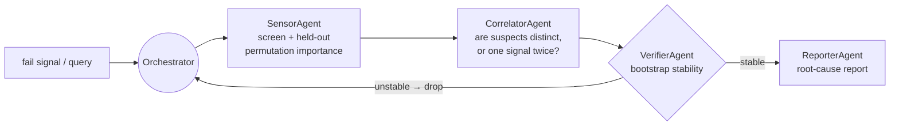
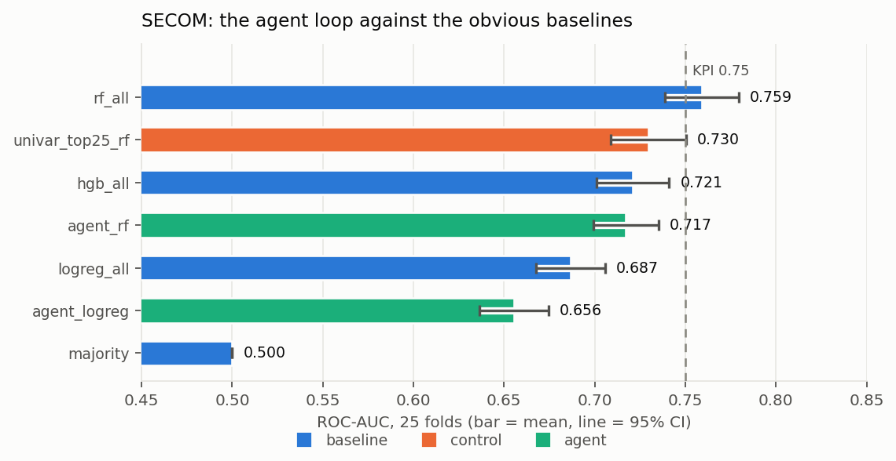
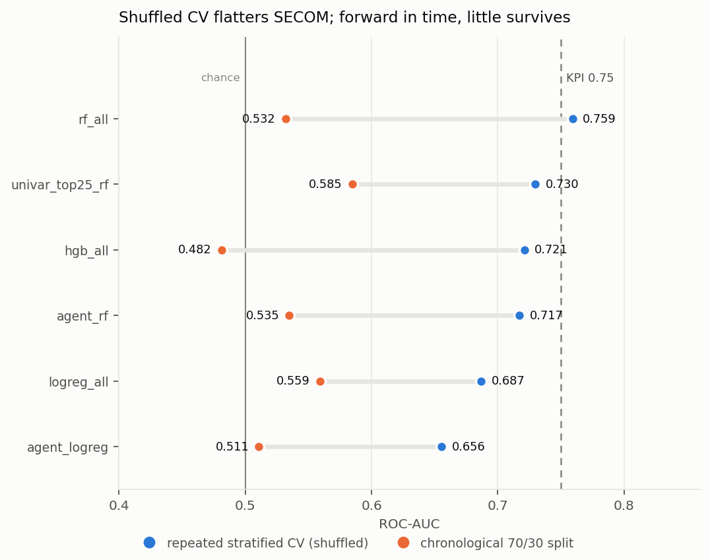
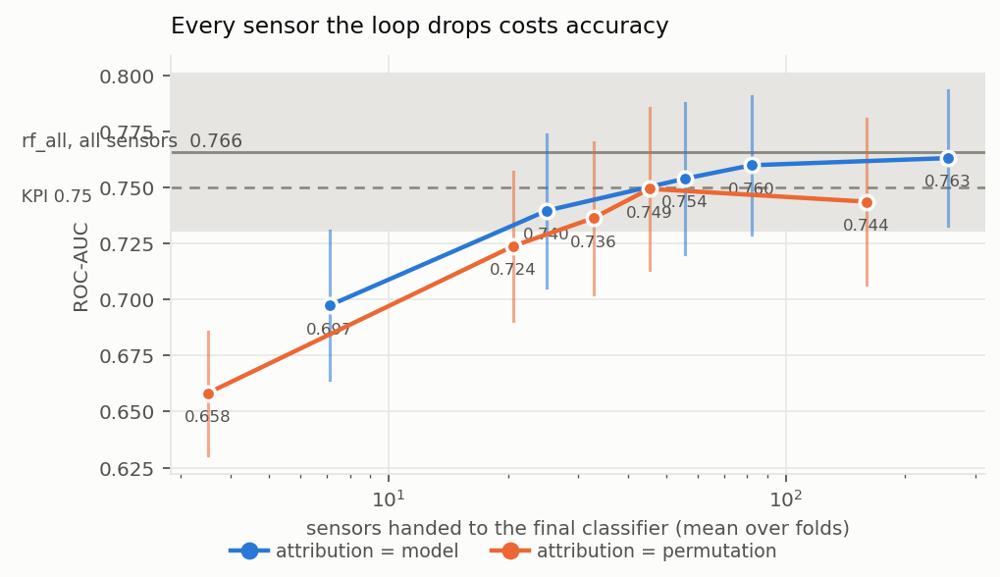
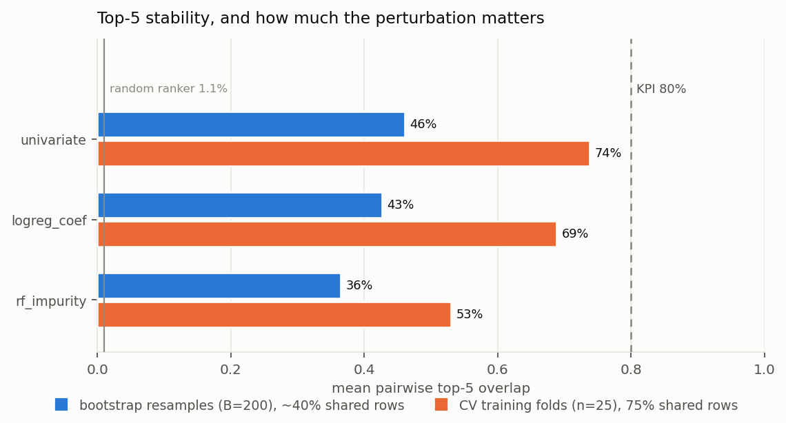
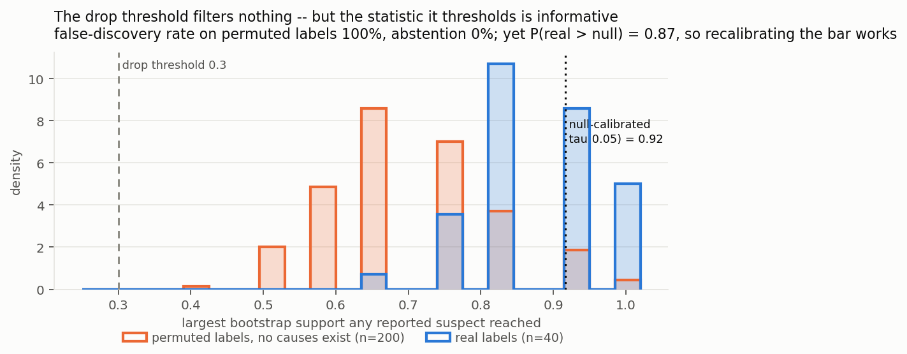
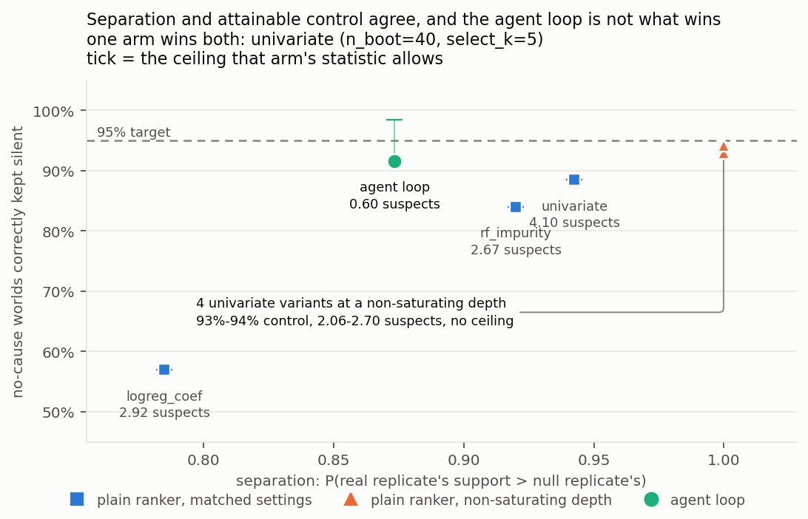
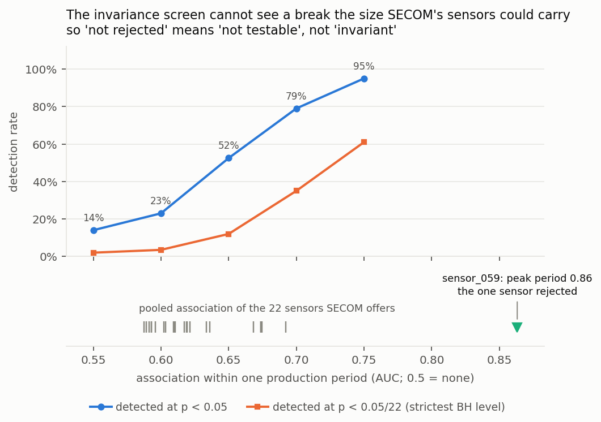
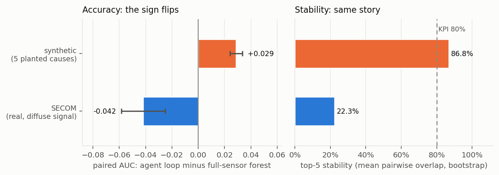

# Yield RCA Agent

**Multi-agent root-cause analysis for semiconductor yield loss, measured
honestly on real fab data.** A plan → execute → verify loop routes
role-specialized agents — attribution, correlation, verification, reporting —
over a fab's process sensors to say *which* signals are implicated in wafer
fail, and how much that answer moves when you resample the wafers.

The interesting part of this repo is not that it produces a root-cause list. It
is that the list is scored against the obvious baseline under a protocol that
cannot flatter it — and that the result is largely negative. That result is
reported here in full rather than buried.

<!-- BEGIN:intro_data -->
The real data is the **UCI SECOM** dataset: 1,567 wafers, 590 process sensors, 104 fails (6.6%, a 1:14 imbalance), 4.5% of cells missing, 90 days of a single campaign. It is evaluated under RepeatedStratifiedKFold(5 splits x 5 repeats, seed 0) = 25 folds, plus a chronological split and a rolling-origin split that never trains on a wafer produced after the one it scores.
<!-- END:intro_data -->



The agents are deterministic tool users, not LLMs. Nothing in this repo calls a
model API; that keeps every number reproducible from a seed, and an LLM
narrating the same tool output would add prose rather than evidence.

<!-- BEGIN:headline -->
- **The AUC KPI is met, by the baseline.** A plain random forest with fold-internal cleaning and median imputation scores **0.759** [0.739, 0.779] ROC-AUC over 25 folds of repeated stratified CV, so the >= 0.75 target is **met** before any agent runs. That is squarely inside the 0.70-0.80 band published for SECOM; anything far above it on this dataset is a leak, not a result.
- **The agent loop does not beat that baseline -- it loses to it.** Same folds, paired per fold: **-0.042 [-0.058, -0.025]** AUC (4 folds better, 21 worse, Wilcoxon p = 6.4e-05). At its pre-registered operating point the loop reaches 0.717 and misses the KPI on its own, and it does not separate from a univariate top-25 selection at the same sparsity (-0.012 [-0.028, +0.004], an interval that includes zero). The plan/verify machinery is not what is buying the number.
- **Sparsity is the price, and it is not negotiable.** Sweeping the loop's settings, AUC tracks how many sensors survive. The leanest configuration whose paired CI still reaches the baseline is `agent_operating_model` at -0.0262 [-0.0524, +0.0000], keeping about 25 sensors -- but that CI only just touches zero, so read it as a boundary case rather than a tie; the leanest *unambiguous* tie keeps about 45. The loop can match a full-sensor forest, but only by declining to be a shortlist -- every setting that returns a list short enough for an engineer to work through is measurably worse.
- **The top-5 stability KPI is not met on the protocol it should be scored on.** Under the definition fixed in `yieldrca/stability.py` -- mean pairwise overlap of the top 5, re-derived from scratch on each of 200 bootstrap resamples -- the loop scores **22.3%** (22.8% after grouping sensors correlated above |r| = 0.99) against a >= 80% target and a 1.1% random-ranker floor. Across 80%-overlapping CV training folds -- a much gentler shake of the same data -- it reads 37.2%. Both are reported; the harder one is the headline. With 104 fails, which five of 474 sensors come out on top is barely determined.
- **Shuffled CV flatters this dataset.** Train on the earliest 1097 wafers and test on the last 470, and the best baseline falls from 0.759 to **0.532** -- near chance, with every arm collapsing (worst: `hgb_all` at 0.482). Repeating the exercise at every origin -- train on the past, test on the next block of wafers -- puts the best arm at 0.656 (`agent_rf`), so this is not one unlucky split. Over the 90 days of a single campaign the sensor distributions drift, and a shuffled split lets the model interpolate across drift it would never see in production. The KPI is stated against the shuffled protocol, so that is what the scorecard reports -- but the forward-in-time number is the one an engineer should believe.
- **And the drift is measured, not assumed.** Label each wafer by *era* instead of outcome -- early 70% versus late 30% -- and the same pipeline separates the two eras from the sensors alone at **0.993** AUC (0.516 with the era label shuffled). The process data says far more about *when* a wafer was made than about *whether it failed*: 70.7% of sensors shift significantly between the first and last time block, and the fail rate itself runs 3.5% to 14.0% across blocks (chi-square p = 1e-07). On a non-stationary process, "the top 5 causes" is not a fixed quantity measured noisily -- it is a quantity that moves while you measure it.
- **One result points the other way, and it is the weakest one here.** Forward in time the ordering inverts: the best arm across origins is `agent_rf` at 0.656, and the agent loop is +0.071 [-0.072, +0.214] against the full-sensor forest instead of behind it. Selecting fewer sensors plausibly helps precisely when the test distribution has moved. But that interval includes zero over only 4 origins, so it is a hypothesis worth a bigger dataset, not a finding. Repeating the protocol at five block counts (below) keeps the sign at every one but puts the median effect at +0.017 rather than +0.071, and no single interval excludes zero.
- **It reports root causes on data that has none.** Permute the labels so no sensor carries any information about failure, and the full plan/attribute/verify/drop loop still names 13.7 suspects per replicate and abstains on 0.0% of them -- 2,743 false discoveries over 200 replicates, a false-discovery rate of **100%**. The advertised safeguard, that unstable suspects are dropped, does not hold: 13.7 pure-noise sensors clear the stability threshold unaided, and the never-empty fallback is not even needed (0.0%). The statistic is salvageable -- P(real > null) = 0.87 -- so a threshold calibrated on that null, tau = 0.91, restores control. It also shortens the SECOM report from 20.9 suspects to **0.60**, empty 51.3% of the time. That is what this dataset actually supports.
- **And the invented causes are fresh each time, not an artefact.** Null replicates agree with each other on only 0.014 of their top-5 against a random-ranker floor of 0.011, naming 417 of 474 sensors at least once across the run. So the loop is not re-reporting SECOM's correlation structure under the null; it is manufacturing a different answer every time it is asked.
- **And a univariate ranker does the same job better.** Matched to the loop's own bootstrap count and selection depth, plain rankers separate the two worlds better (`univariate` 0.943 vs 0.873) but their support *saturates*, capping their error control below the loop's. Narrow the selection depth so it stops saturating and the cap disappears: `univariate (n_boot=40, select_k=5)` reaches 94.3% control against the loop's 91.6% at a 95% target, separates at 1.000, and still reports 2.06 suspects against 0.60 -- with no permutation-importance pass, no correlation grouping and no verification loop. **So on every axis measured here the loop is matched or beaten by a univariate ranker.** Two caveats travel with that: the selection depth was probed for the baseline and not for the loop, and the separation column rewards a repeatable ranker as well as a discriminating one. Both are detailed in the section below.
- **The machinery works where its premise holds.** On the synthetic generator -- 5 genuinely causal sensors among 200, block-correlated noise -- the loop recovers 98% of them in its top 5, scores 86.8% top-5 stability (KPI met), and beats the full-sensor forest by +0.029 [+0.024, +0.033] AUC -- the *opposite* sign to SECOM. The loop assumes a few sensors drive the failures; where that is true it wins on accuracy and stability, and where the signal is spread thin it throws away what the model needed. **Recovery is only ever claimed on synthetic data; SECOM has no causal labels and none is reported for it.**
<!-- END:headline -->

Full tables, protocol and provenance: [`RESULTS.md`](RESULTS.md). Every figure
in this README and in `RESULTS.md` — and every comparative sentence built
around one — is generated by `scripts/report.py` from the JSON under `runs/`.
`scripts/report.py --check` fails CI if either file drifts from the JSON, so a
stale number cannot survive a commit.

## Two benchmarks, and the line between them

This distinction is the whole reason the results above can be trusted, so it is
stated before any of them:

| | **synthetic** (`demo_smoke.py`, `scripts/eval_synthetic.py`) | **real** (`scripts/eval_secom.py`) |
|---|---|---|
| data | generated: causal sensors planted among correlated decoys | UCI SECOM, as donated |
| ground-truth root causes | **yes, by construction** | **none exist** |
| what can be claimed | held-out AUC, top-5 stability, **and recovery of the planted causes** | held-out AUC and top-5 stability, **and nothing about causes** |

SECOM ships a pass/fail label and a wall of anonymous sensor traces. It does
not ship an answer key, and no amount of attribution machinery creates one. So
"n/5 causal sensors recovered" is a claim this repo makes **only** on synthetic
data, and it is never carried over. A ranked SECOM suspect list is a
*hypothesis for an engineer to go test on the tool*, not a recovered cause.

## KPI scorecard

<!-- BEGIN:kpi -->
The catalog target for this project is `SECOM real-data AUC >= 0.75` and `top-5 cause stability >= 80%`. Scored honestly:

| KPI | measured on | value | verdict |
|---|---|---|---|
| SECOM ROC-AUC >= 0.75 | best plain baseline (`rf_all`) | 0.759 [0.739, 0.779] | **met** (point estimate; CI spans it) |
| SECOM ROC-AUC >= 0.75 | agent loop (`agent_rf`) | 0.717 [0.699, 0.735] | **not met** |
| top-5 cause stability >= 80% | agent loop, pairwise overlap, bootstrap | 22.3% | **not met** |
| top-5 cause stability >= 80% | agent loop, cluster-aware pairwise, bootstrap | 22.8% | **not met** |
| top-5 cause stability >= 80% | agent loop, pairwise, CV training folds (the gentler perturbation -- shown so the choice of protocol is visible) | 37.2% | **not met** |

Read together: the prediction KPI is met -- but by the plain baseline, not by the agent loop, which lands at 0.717 and misses it, and the stability KPI is missed by 58 points on the primary bootstrap protocol. The one-line summary is that on SECOM this pipeline is a usable *predictor* and an unreliable *root-cause attributor*, and the second half of that sentence is the finding.

One caveat on the first row, stated rather than buried: the point estimate 0.759 clears 0.75, but the 95% CI over folds runs [0.739, 0.779] and so includes values below the target. "Met" here means the mean of 25 folds is above the line, not that the line is cleared with confidence.
<!-- END:kpi -->

## The data, as it actually arrives

<!-- BEGIN:dataset -->
Every count here is measured by `scripts/prepare_data.py`, not quoted from the dataset description:

| property | value |
|---|---|
| wafers x sensors | 1,567 x 590 |
| fails / pass:fail ratio | 104 (6.64%) / 1:14.1 |
| time span | 90 days, timestamps monotone |
| missing cells overall | 4.54% |
| sensors with any missing value | 538 of 590 |
| sensors over 50% missing | 28 |
| worst single sensor | 91.2% missing |
| wafers with at least one missing value | 1,567 of 1,567 (all of them) |
| constant sensors (zero variance) | 116 |
| exact-duplicate sensor groups | 7 covering 104 removable columns |
| sensors surviving the cleaner | 474 of 590 (116 dropped) |
| missing-indicator columns appended | 98 |
| sensors with an \|r\| > 0.99 partner | 179 (370 correlation clusters over 474 kept sensors) |

All 7 exact-duplicate groups turn out to sit *inside* the 116 constant sensors: once those are dropped, 0 exact duplicates remain. Near-duplicates are the real problem -- 179 of the 474 surviving sensors have a partner above |r| = 0.99, which is why the pipeline groups them and why the stability KPI is reported both per sensor and per group.
<!-- END:dataset -->

## Handling the mess, inside the fold

Missing values, constant columns and duplicated sensors are not a preprocessing
footnote on SECOM — they are most of the problem, and the standard way to get a
too-good number is to resolve all three while looking at the whole dataset.
Every such decision here is a `fit` on the training fold:

- **Missing values.** Kept as `NaN` by the loader, and resolved differently per
  arm because the models differ: `hgb_all` hands them straight to
  `HistGradientBoostingClassifier`, which learns a split direction for
  missingness natively; the forest and logistic arms median-impute *per fold*.
  Imputation destroys the fact that a value was absent, and in a fab "the
  metrology step did not report" is itself a signal, so the logistic arm
  re-attaches it explicitly — `MissingIndicatorAppender` adds a 0/1 column for
  every sensor missing in that fold. (The forest arm does not; whether it would
  help is untested here, and listed under Limits rather than assumed.)
- **Constant columns.** Zero variance over the fold's observed values, so they
  carry nothing and make standardisation ill-posed. Dropped, with the reason
  recorded per column in `SensorCleaner.dropped_`.
- **Duplicated sensors.** Identical values *and* identical NaN pattern within
  the fold; all but the first are dropped. Left in, one physical signal's
  importance is split across several identical names, which corrupts any top-k
  stability measurement before it starts.
- **Near-duplicates.** The harder case, and the common one here: sensors that
  are near-identical without being identical. `CorrelatorAgent` groups them at
  its configured `corr_thresh` and reports one representative per group; the
  stability KPI is then reported both per sensor and per correlation group, at
  the threshold named in that section, so the effect of the choice is visible
  rather than baked in. Counts at each threshold are in the dataset table.

The count of what each rule removes is in the dataset table above, measured by
`scripts/prepare_data.py`.

## SECOM: prediction

<!-- BEGIN:secom_auc -->
25 folds, identical for every arm (RepeatedStratifiedKFold(5 splits x 5 repeats, seed 0) = 25 folds). Baseline hyperparameters are chosen by an inner 3-fold grid search on each outer training fold, so no baseline here is the best of a grid scored on the test folds. The delta column is a **paired** per-fold difference against `rf_all`.

| arm | what it is | ROC-AUC (95% CI) | avg precision | paired delta vs `rf_all` | chrono AUC |
|---|---|---|---|---|---|
| `rf_all` | random forest, all sensors (tuned inner-CV) | 0.759 [0.739, 0.779] | 0.210 | -- | 0.532 |
| `univar_top25_rf` | univariate top-25 sensors -> random forest | 0.730 [0.709, 0.750] | 0.200 | -0.029 [-0.041, -0.018] | 0.585 |
| `hgb_all` | hist gradient boosting, all sensors (tuned inner-CV) | 0.721 [0.701, 0.741] | 0.202 | -0.038 [-0.057, -0.019] | 0.482 |
| `agent_rf` | agent loop (RF probe + RF on survivors) | 0.717 [0.699, 0.735] | 0.195 | -0.042 [-0.058, -0.025] | 0.535 |
| `logreg_all` | logistic regression, all sensors (C tuned inner-CV) | 0.687 [0.668, 0.706] | 0.158 | -0.072 [-0.088, -0.056] | 0.559 |
| `agent_logreg` | agent loop (logistic probe + logistic on survivors) | 0.656 [0.637, 0.675] | 0.145 | -0.103 [-0.125, -0.082] | 0.511 |
| `majority` | majority class (DummyClassifier) | 0.500 [0.500, 0.500] | 0.066 | -0.259 [-0.279, -0.239] | 0.500 |

The best arm is `rf_all` at 0.759. A plain random forest with fold-internal cleaning and median imputation reaches **0.759** [0.739, 0.779], so the AUC KPI (>= 0.75) is **met** -- by the baseline, before any agent runs.

The agent loop scores 0.717 [0.699, 0.735] while handing the final classifier 20 sensors on average -- screened from the survivors down to 60 cluster representatives, then cut again by the bootstrap drop. Paired against the baseline that is -0.042 [-0.058, -0.025] AUC (4 folds better, 21 worse, Wilcoxon p = 6.4e-05). That interval excludes zero: **the agent loop does not beat the obvious baseline on SECOM, it loses to it.**

The naive-selection control tells us how much of that is selection per se rather than this particular selector: univariate top-25 into the same forest is -0.029 [-0.041, -0.018] against the baseline, and the agent loop differs from *it* by -0.012 [-0.028, +0.004] -- an interval that straddles zero, so the plan/verify machinery buys no measurable accuracy over ranking each sensor on its own.

The chronological column trains on the earliest 1097 wafers and tests on the last 470 (26 fails). All 6 non-trivial arms score lower there than under shuffled CV; `rf_all` falls from 0.759 to 0.532, and the whole field lands between 0.482 (`hgb_all`) and 0.585 (`univar_top25_rf`). That is close enough to chance to say the plain reading out loud: **forward in time, none of these models has much predictive power on SECOM.** Over the 1567 wafers of a 90-day campaign the sensor distributions drift, and a shuffled split quietly lets the model interpolate across drift it would never see in production. The KPI is stated against the shuffled protocol, so that is what the scorecard scores -- but this column is the one that decides whether the thing is deployable.
<!-- END:secom_auc -->



## Does it survive going forward in time?

<!-- BEGIN:rolling -->
One chronological split can be one unlucky fortnight, so the same question is asked at every origin: 5 contiguous time blocks; train on blocks 0..k, test on block k+1, for k = 0..3. This is the only protocol here that answers *would this have worked had we deployed it* -- it never trains on a wafer produced after the one it scores.

| arm | shuffled CV | chrono 70/30 | rolling origin, mean of 4 (95% CI) | per origin |
|---|---|---|---|---|
| `agent_rf` | 0.717 | 0.535 | 0.656 [0.495, 0.816] | 0.563 · 0.721 · 0.762 · 0.576 |
| `univar_top25_rf` | 0.730 | 0.585 | 0.644 [0.399, 0.888] | 0.510 · 0.863 · 0.622 · 0.578 |
| `hgb_all` | 0.721 | 0.482 | 0.597 [0.373, 0.820] | 0.512 · 0.782 · 0.626 · 0.467 |
| `rf_all` | 0.759 | 0.532 | 0.585 [0.349, 0.821] | 0.450 · 0.780 · 0.618 · 0.491 |
| `agent_logreg` | 0.656 | 0.511 | 0.559 [0.367, 0.750] | 0.579 · 0.612 · 0.385 · 0.659 |
| `logreg_all` | 0.687 | 0.559 | 0.513 [0.271, 0.755] | 0.381 · 0.502 · 0.441 · 0.729 |
| `majority` | 0.500 | 0.500 | 0.500 [0.500, 0.500] | 0.500 · 0.500 · 0.500 · 0.500 |

Two things happen at once here, and only one of them is solid.

**Solid: everything degrades.** The best shuffled-CV arm (`rf_all`, 0.759) drops to 0.585 [0.349, 0.821] forward in time, and every arm's rolling-origin CI includes 0.5. Whatever SECOM's shuffled-CV skill is made of, a substantial part of it does not survive being asked to predict the next block of wafers.

**Not solid: the ranking inverts.** Only 9 of the 15 arm pairs keep their shuffled-CV order, and the best arm forward in time is `agent_rf` (0.656, an agent arm) rather than `rf_all`. Paired over the 4 origins, the agent loop is +0.071 [-0.072, +0.214] against the full-sensor forest -- an interval that includes zero, so this is a *suggestion*, not a result. The mechanism is plausible -- a model holding 20 sensors has fewer ways to lean on one that drifts than one holding all 474, so selection should pay off exactly when the test distribution moves -- and that is a reason to test it properly, not to claim it. 4 origins with per-origin AUCs spanning 0.381 to 0.863 cannot settle it.

Test blocks grow from 314 wafers (21 fails) as the training window expands, so individual origins are noisy by construction. The honest summary: SECOM's shuffled-CV numbers are the optimistic ones, a yield predictor trained this way should not be expected to hold for the next month of wafers without retraining, and whether sparse attribution helps under drift is the experiment this dataset is too small to run.
<!-- END:rolling -->



## Is it really drift?

<!-- BEGIN:drift -->
"The sensors drift" is the obvious explanation for the section above, and obvious explanations are exactly the ones that get written into a README without being checked. Three checks, from `scripts/drift.py`:

| check | value | note |
|---|---|---|
| adversarial validation: can the sensors tell you *when* a wafer was made? | 0.993 [0.991, 0.995] | 1097 early vs 470 late wafers |
| the same test with the era label shuffled (control) | 0.516 [0.500, 0.531] | must land at chance, or the row above means nothing |
| sensors whose distribution moved between the first and last time block | 324 of 458 (70.7%) | KS two-sample, Benjamini-Hochberg FDR 0.01 |
| median / p90 / max KS statistic per sensor | 0.205 / 0.434 / 0.791 | 0 = identical distributions, 1 = disjoint |
| fail rate across time blocks | 3.5% to 14.0% | chi-square p = 1.04e-07 |

The adversarial test is the decisive one. Label each wafer by *era* rather than by outcome -- early 70% versus late 30% -- and the same pipeline that struggles to reach 0.75 predicting **failure** separates the two eras at **0.993** [0.991, 0.995] from the sensors alone, against 0.516 for the shuffled control. That is essentially perfect: the process data carries a much stronger signal about *when* a wafer was made than about *whether it failed*. The training and test halves of the chronological split are not two samples of one distribution, and 70.7% of individual sensors confirm it one at a time.

Label drift is also present: the fail rate ranges 3.5% to 14.0% across blocks (chi-square p = 1.04e-07), so part of the forward-in-time collapse is the *prior* moving, not only the features. The two effects are not separable at this sample size, and neither is a modelling problem to be fixed by a better ranker.

This is also the cleanest argument for why the top-5 stability KPI is hard here in a way no ranker fixes. If the sensors themselves are non-stationary over the 90 days, "the top 5 causes" is not a fixed quantity being estimated noisily -- it is a quantity that changes while you estimate it.
<!-- END:drift -->

## Is the pre-registered operating point the problem?

<!-- BEGIN:sweep -->
The agent loop's structural settings are fixed in advance rather than tuned, which is only defensible if the surface around them is published instead of hidden. Same protocol as above (RepeatedStratifiedKFold(5 x 2, seed 0); identical folds for every row), 10 folds, 12 min:

| arm | attribution | vote k / threshold / cap | sensors selected | ROC-AUC (95% CI) | paired delta vs `rf_all` |
|---|---|---|---|---|---|
| `rf_all` | -- | -- | 472.8 | 0.766 [0.731, 0.801] | -- |
| `agent_no_drop_model` | model | 474 / 0.0 / 474 | 256.4 | 0.763 [0.733, 0.793] | -0.003 [-0.017, +0.011] |
| `agent_loose_model` | model | 100 / 0.15 / 150 | 82.0 | 0.760 [0.729, 0.791] | -0.006 [-0.028, +0.016] |
| `agent_wide_model` | model | 60 / 0.2 / 60 | 55.8 | 0.754 [0.720, 0.788] | -0.012 [-0.031, +0.007] |
| `agent_loose_permutation` | permutation | 100 / 0.15 / 150 | 45.4 | 0.749 [0.713, 0.786] | -0.016 [-0.045, +0.012] |
| `agent_no_drop_permutation` | permutation | 474 / 0.0 / 474 | 160.1 | 0.744 [0.707, 0.781] | -0.022 [-0.049, +0.005] |
| `agent_operating_model` | model | 40 / 0.3 / 25 | 25.0 | 0.740 [0.706, 0.774] | -0.026 [-0.052, +0.000] |
| `agent_wide_permutation` | permutation | 60 / 0.2 / 60 | 32.8 | 0.736 [0.703, 0.770] | -0.029 [-0.058, -0.001] |
| `univar_top25_rf` | -- | -- | 25.0 | 0.729 [0.693, 0.766] | -0.037 [-0.060, -0.013] |
| `agent_operating_permutation` | permutation | 40 / 0.3 / 25 | 20.6 | 0.724 [0.691, 0.757] | -0.042 [-0.072, -0.012] |
| `agent_sparse_model` | model | 20 / 0.5 / 25 | 7.1 | 0.697 [0.664, 0.731] | -0.068 [-0.097, -0.039] |
| `agent_sparse_permutation` | permutation | 20 / 0.5 / 25 | 3.5 | 0.658 [0.631, 0.686] | -0.108 [-0.147, -0.069] |

AUC tracks how many sensors survive, and it does so almost monotonically: 41 of the 45 (sparsity, AUC) pairs are concordant, from 4 sensors at 0.658 up to 256 at 0.763, against 0.766 for using all of them. SECOM's predictive signal is spread thinly over many weak sensors rather than concentrated in a few, so sparsity is not free.

That does not make the loop uniformly worse. 6 of the 10 configurations have a paired CI that reaches the baseline -- `agent_operating_model`, `agent_loose_permutation`, `agent_wide_model`, `agent_loose_model`, `agent_no_drop_permutation`, `agent_no_drop_model` -- and the leanest of those keeps about 25 sensors. **So the loop can match a full-sensor forest, but only by declining to be a shortlist.** Every configuration returning a list short enough for an engineer to work through (4 of them, down to 4 sensors) is measurably worse.

Two caveats on those ties, both in the direction of not over-claiming. 2 of them (`agent_operating_model`, `agent_no_drop_permutation`) have a CI that only just touches zero, which is a boundary case rather than a demonstrated equivalence. And this sweep runs 10 folds where the headline table runs 25, so its intervals are wider and it has *less* power to separate arms -- a tie here is weaker evidence than a tie there. The headline comparison is the one with the folds.

The fairest single comparison in the table is at matched sparsity. `univar_top25_rf` keeps 25 sensors chosen one at a time; `agent_operating_model` keeps 25 chosen by the full loop. Paired over the same folds the loop is +0.010 [-0.004, +0.024] against it -- an interval including zero, so at equal budget the plan/verify machinery is not measurably better than ranking each sensor on its own. That is the comparison the loop most needs to win, and on this data it does not win it decisively either way.

The limit row is the sanity check rather than a result: with the drop step disabled (`stability_min` 0, no cap) `agent_no_drop_model` lands at 0.763, -0.003 [-0.017, +0.011] from the baseline. The wrapper degrades back onto the baseline as it should, so the gap at the operating point is the selection doing damage, not a defect in the plumbing.

One design axis does pay: scoring suspects by the base model's own importance averaged over resamples beats held-out permutation AUC-drop at 5 of the 5 matched depths (mean gap +0.021 AUC). With roughly 25 positives in an inner validation split, the permutation estimate is simply too noisy to rank on, which is the same sample-size story the stability section tells.
<!-- END:sweep -->



## SECOM: top-5 stability

<!-- BEGIN:stability -->
The metric was defined in `yieldrca/stability.py` before it was measured, because it has enough degrees of freedom that defining it afterwards would be meaningless. **Primary: mean pairwise top-5 overlap** -- the average, over all pairs of resamples, of |T_b n T_b'| / 5, where T_b is the top 5 of a ranking re-derived from scratch on resample b. It has no reference set, so it cannot be inflated by choosing the reference after the fact. The **consensus** column instead picks the 5 most frequent sensors *after* seeing every resample and averages their selection frequency, which is why it is always the friendlier number. The **cluster** columns map each sensor to its |r| >= 0.99 correlation group first.

Two perturbation schemes, and the choice matters more than any modelling decision below it. `bootstrap` is 200 resamples with replacement -- each sees ~63% of the wafers as unique rows, so two replicates share under half their data. `cv_train` is the 25 training folds of the same repeated CV the AUC table uses -- at 5 folds those are 80% of the data each and share 75% of their rows, a much gentler shake. **Bootstrap is reported as primary** because it is the standard stability-selection perturbation and because a KPI should be scored against the harder of two defensible protocols, not the kinder one.

| ranker | what it ranks by | pairwise (bootstrap) | pairwise, cluster-aware | consensus (bootstrap) | pairwise (CV folds) | pairwise, cluster-aware (CV) |
|---|---|---|---|---|---|---|
| `univariate` | per-sensor \|AUC - 0.5\| | 46.1% | 46.0% | 61.1% | 73.7% | 73.7% |
| `logreg_coef` | \|standardised logistic coefficient\| | 42.6% | 42.6% | 55.9% | 68.8% | 68.8% |
| `rf_impurity` | random-forest impurity importance | 36.5% | 36.6% | 49.7% | 53.0% | 53.0% |
| `agent` | full agent loop: attribute -> correlate -> verify -> drop | 22.3% | 22.8% | 36.0% | 37.2% | 37.3% |
| `agent_no_corr` | attribute -> verify -> drop, correlation grouping off | 22.1% | 22.6% | 35.0% | 35.7% | 35.9% |
| `perm_only` | SensorAgent only: screen + held-out permutation AUC drop | 20.0% | 20.6% | 32.8% | 34.1% | 34.3% |

A uniformly random ranker scores 1.1% raw (5 of 474 surviving sensors) and 1.4% cluster-aware (5 of 370 clusters), so every row is far clear of chance.

The full agent loop reaches **22.3%** pairwise overlap under bootstrap resampling (22.8% cluster-aware) and 37.2% across CV training folds. Against the >= 80% KPI that is **not met** on the primary protocol, **not met** cluster-aware, and **not met** under the gentler CV-fold perturbation.

The most stable ranker in the table is `univariate` -- the plan/verify machinery does not buy stability over simply ranking each sensor on its own, which is the same conclusion the AUC table reaches from the other direction.

**Which part of the loop does the stability work?** The three rows form a ladder, each step adding one mechanism, so each difference isolates one thing rather than two:

| ranker | mechanism added | pairwise (bootstrap) | step |
|---|---|---|---|
| `perm_only` | screen + held-out permutation only | 20.0% | -- |
| `agent_no_corr` | + bootstrap verify-and-drop | 22.1% | +2.1% |
| `agent` | + correlation grouping | 22.3% | +0.2% |

So verification is worth +2.1% of top-5 agreement and grouping +0.2%. Only one of the two steps is doing measurable work here. Note also that the raw and cluster-aware columns barely differ across the whole table, which says the top 5 mostly are *not* drawn from the near-duplicate families that motivated grouping -- the instability is between genuinely different sensors.

Two different gaps are visible here and they should not be conflated. The first is between rankers: `univariate` is +23.7% above the full loop, so *choice of ranker matters a great deal* -- held-out permutation importance, scored on an inner split holding roughly 25 positives, is simply a noisier statistic than a univariate AUC or a fitted coefficient. That is the same finding the sensitivity sweep reached from the accuracy side, and it is actionable: the loop's attribution mode is a parameter.

The second gap is the one no ranker closes. Even `univariate`, the most stable thing in the table, sits 34% short of the 80% KPI. Resampling 1,567 wafers with replacement leaves out about 37% of them, so at this class balance each replicate sees a different ~65 fails, and which five of 474 weakly informative sensors come out on top is not determined at that sample size. The consensus column says the same from the other side: some sensors recur far more often than chance, but not the *same five* run to run. A better ranker would narrow the first gap; only more failed wafers narrows the second.
<!-- END:stability -->



## Does the loop invent root causes when there are none?

<!-- BEGIN:null_fdr -->
The pitch is that a suspect failing the bootstrap stability check is dropped, so what survives is trustworthy. That is a claim about a false-discovery rate, and it is measurable: build a world with no causal sensors and count what the loop reports anyway.

**The null.** labels permuted over all wafers (class balance preserved exactly: 104 fails / 1,463 passes); X untouched. Every sensor reported under this null is a false discovery by construction. 200 such replicates, against 40 replicates of the identical loop on the true labels (identical loop, true labels, random_state varied per replicate so both arms are distributions over the loop's internal randomness). From `scripts/null_fdr.py`, written to `runs/null_fdr.json`.

| quantity | permuted labels (no causes exist) | real labels | note |
|---|---|---|---|
| sensors reported as root causes, per replicate | 13.7 | 20.9 | mean over replicates |
| ...of which cleared the stability threshold on merit | 13.7 | 21.1 | threshold pi = 0.3 |
| replicates reporting nothing at all (abstention) | 0.0% | 0.0% | the only outcome that would be correct on the null |
| replicates where the never-empty fallback fired | 0.0% | 0.0% | `estimator.py`: `if not surv: surv = reps[:5]` |
| largest bootstrap support any suspect reached | 0.703 | 0.873 | mean; the statistic the drop step thresholds |
| ...its 5th-95th percentile across replicates | [0.500, 0.917] | [0.750, 1.000] | how far apart the two worlds sit on the loop's own statistic |

**The loop abstained never once.** Over 200 permuted-label replicates it named 2,743 sensors as root causes. Every one of them is a false discovery by construction, so the false-discovery rate of the reported suspect list under this null is **100%**.

**And the mechanism is not the one the code invites you to blame.** `AgentRCA.fit` carries two never-return-empty-handed guards (`estimator.py`, `if not surv: surv = reps[:5]`), which would produce exactly this result -- but they fired on 0.0% of null replicates. They are not what is happening. The threshold itself is: 13.7 pure-noise sensors per replicate clear pi = 0.3 **on their own merit**. To clear it, a sensor need only reach the top 40 of a 60-sensor candidate pool in 4 of 12 bootstrap replicates -- which noise does routinely. Lowering or raising the guard changes nothing; the bar is in the wrong place.

**Is the loop at least *more* confident on real data?** P(real replicate's best support > null replicate's best support) = **0.873**, where 0.5 is no information (Mann-Whitney p = 1.57e-14), so the statistic is strongly informative about whether the labels were real -- it is the *threshold* that is mis-set, not the measurement, and the next section prices the recalibration.

### What it would cost to let it say nothing

Same run, no refits: every figure below is a function of the per-replicate suspect supports in `runs/null_fdr.json`, computed by `scripts/abstain.py` into `runs/abstain.json`.

**The rule.** report suspect j iff its bootstrap support s_j >= tau(alpha), where tau(alpha) is the (1-alpha) quantile of max_j s_j over null replicates (Westfall-Young max-statistic, family-wise over the sensors screened).

**The calibration is held out.** fitting tau and measuring abstention on the same replicates returns 1-alpha by construction and measures nothing, so null replicates split in half; tau fitted on one half, all rates reported on the other; both directions averaged over 400 random partitions.

| alpha | tau | held-out null: reports nothing | held-out null: false discoveries | real labels: reports nothing | real labels: suspects reported |
|---|---|---|---|---|---|
| 0.1 | 0.842 | 82.0% (target 90%) | 0.21 | 23.4% | 1.18 |
| 0.05 | 0.910 | 91.6% (target 95%) | 0.09 | 51.3% | 0.60 |
| 0.01 | 0.959 | 97.7% (target 99%) | 0.02 | 78.8% | 0.22 |
| -- none -- | -- | 0.0% | 13.71 | 0.0% | 20.95 |

At alpha = 0.05 the honest SECOM report is **0.60 sensors on average, and empty 51.3% of the time** -- against the 20.9 the pipeline prints today. That is the finding stated as a deliverable: this dataset supports about one named suspect, sometimes none, and the current report's length is not evidence about the process.

**The rule is itself slightly optimistic, and the table says so.** Held-out abstention on the null lands at 91.6% against a nominal 95%, because tau is a quantile estimated from finitely many null replicates and a point estimate of an upper quantile is biased low. Closing that gap means more null replicates or an upper confidence bound on the quantile rather than the quantile itself; it is not closed here, and the shortfall is reported rather than rounded away.

**The bar sits on a coarse grid.** Support is a fraction of 12 bootstrap replicates, so it takes only 13 distinct values and tau cannot be placed between them. At the strictest level here tau lands at or next to the ceiling, which is why the alpha = 0.01 row buys little over alpha = 0.05: there is no room above it. Finer control needs more bootstrap replicates inside the loop, which costs linearly and was not spent here.

`AgentRCA(report_tau=...)` implements the rule. It governs `reported_` only -- `selected_` and `predict_proba` are byte-identical with and without it, asserted in `tests/test_null.py::test_report_tau_lets_the_loop_abstain_on_pure_noise` -- so switching abstention on cannot move any AUC in this repo, and the prediction and attribution claims stay separable.

### Is the null unfairly easy?

One alternative would deflate all of the above: permuting labels leaves the sensor *correlation* structure intact, so perhaps the loop is reporting that structure rather than inventing anything. If so, null replicates would keep naming the same sensors as each other. They do not:

| mean pairwise top-5 overlap | value | over |
|---|---|---|
| null replicates agree with each other | 0.014 | 200 replicates |
| a uniformly random top-5 would agree | 0.011 | 5 / 474 surviving sensors |
| real-label replicates agree with each other | 0.548 | 40 replicates |
| distinct sensors the null ever named | 417 | of 474 |

At 0.014 against a floor of 0.011, the null's suspects are freshly invented on each replicate rather than a stable artefact of the correlation structure. The alternative does not hold, and the false-discovery rate stands.

**The 0.548 is not comparable to this repo's top-5 stability KPI and must not be read as one.** These replicates perturb only the loop's internal random seed on the full wafer set; the KPI perturbs the *wafers*, by bootstrap resampling, which is a far harder test and is why it reads much lower in the stability section. The number is here only as the upper reference for the null column beside it.
<!-- END:null_fdr -->



## Would a plain ranker have calibrated better?

<!-- BEGIN:ranker_fdr -->
The section above shows the loop's bootstrap support *is* informative about whether the labels were real, which is what makes a calibrated threshold work at all. So: does the agent loop's bootstrap support separate a world with causes from one without any better than a plain ranker's does? Comparing raw false-discovery rates would settle nothing -- any procedure that always emits a top-k has FDR 1.0 under this null, so raw FDR cannot distinguish the arms. Two properties can: how well the statistic separates a world with causes from one without, and how much error control it can actually be thresholded to. They disagree here, so both are reported.

**Matched by construction:** every arm uses the agent loop's own n_boot=12 and select_k=40 from AGENT_CFG, and the identical max-over-sensors statistic, so a difference in separation is a difference in the ranker. `SensorCleaner` is fitted once per replicate on the full matrix, outside the bootstrap loop. It is unsupervised -- it drops all-missing, constant and duplicate columns from `X` alone, never `y` -- so a label permutation cannot change its output and it leaks nothing into the null, and `AgentRCA.fit` cleans the same way, so the arms are matched on this too. The held-out calibration is the same split-half procedure `scripts/abstain.py` uses. From `scripts/null_fdr_rankers.py` into `runs/null_fdr_rankers.json`; the agent row is recomputed from `runs/null_fdr.json` by the same code path, so no arm gets a different protocol.

| ranker | P(real > null) | tau (0.05) | no-cause worlds kept silent | ceiling on that | suspects reported | reports nothing |
|---|---|---|---|---|---|---|
| `univariate (n_boot=40, select_k=5)` | 1.000 | 0.622 | 94.3% | 100.0% | 2.06 | 0% |
| `univariate (n_boot=100, select_k=5)` | 1.000 | 0.578 | 94.1% | 100.0% | 2.13 | 0% |
| `univariate (n_boot=12, select_k=5)` | 1.000 | 0.674 | 93.0% | 100.0% | 2.21 | 0% |
| `univariate (n_boot=40, select_k=10)` | 1.000 | 0.751 | 94.2% | 100.0% | 2.70 | 0% |
| `univariate` | 0.943 | 1.000 | 88.5% | 88.5% | 4.10 | 0% |
| `rf_impurity` | 0.920 | 1.000 | 84.0% | 84.0% | 2.67 | 0% |
| **agent (full loop)** | 0.873 | 0.909 | 91.6% | 98.5% | 0.60 | 51% |
| `logreg_coef` | 0.785 | 1.000 | 57.0% | 57.0% | 2.92 | 0% |

The last two columns are the deliverable; the middle two are why the obvious reading of the first one is wrong.

**On separation the plain rankers win.** `univariate (n_boot=40, select_k=5)` distinguishes the two worlds at 1.000 against the full loop's 0.873. Taken alone that says the whole plan/attribute/verify apparatus is a worse signal detector than ranking each sensor on its own -- the same verdict the AUC and stability tables reach, from a third direction.

**And once the operating point stops flattering it, the plain ranker controls error better too.** `univariate (n_boot=40, select_k=5)` reaches 94.3% against the loop's 91.6%, at a 95% target -- while still reporting 2.06 suspects against the loop's 0.60, and abstaining on 0% of real replicates against 51%.

That qualifier is the whole result, so it is worth being exact about it. Matched to the agent loop's own settings (`select_k = 40` of 474 sensors, `n_boot = 12`), a plain ranker's support **saturates**: its best sensor sits in the top slice of every resample, so the statistic pins at 1.000 on real labels and on 11.5% of permuted ones too. No threshold at or below 1.000 excludes those, so `univariate` is capped at 88.5% control for any threshold rule of the form used here -- below the loop's 91.6%, which is what made the matched comparison alone look like a win for the architecture.

Narrowing the selection depth removes the saturation entirely. Every variant row above reaches a 100% ceiling and lands within 0.7 points of nominal, without a permutation-importance pass, a correlation-grouping step, or a verification loop. The agent loop's apparent advantage was a property of the operating point it was compared at, not of the plan/attribute/verify architecture.

**So the loop has no measured advantage on any axis in this repository.** It loses on held-out AUC, it loses on top-5 selection stability, it loses on how well its confidence separates signal from noise, and it loses on how much false-discovery control that confidence can be calibrated to. The one place it wins remains the synthetic generator, where its premise -- that a few sensors dominate -- is true by construction.

**Three things this comparison does not establish**, all raised by an adversarial review of it and recorded in `critique_log.md`:

- *Separation is confounded with repeatability.*  So the separation column should be read as the weaker of the two, and the error-control column as the one that carries the argument.
- *Report length is not an accuracy axis.* 
- *The selection depth was probed for one arm.* `select_k = 5` was chosen because it removes the saturation, and the corresponding agent configuration is a separate run. Until that lands, this table shows a tuned baseline against an untuned loop, which is the right comparison for "would something simpler have done" and the wrong one for "is the architecture worse at equal effort".

*This paragraph replaces an earlier conclusion in this repository's history.* The matched-settings comparison alone showed the loop as the only arm able to carry a false-discovery guarantee, and that was written up as its first genuine win. The follow-up run in the table above refuted it. Both are in `critique_log.md`; the earlier reading was wrong because it compared one operating point and generalised to an architecture.

### Ranker or depth? (the symmetric run)

The table above tunes the baseline's selection depth and leaves the loop at its pre-registered one, which answers *would something simpler have sufficed* and not *is the architecture worse at equal effort*. This is the second question, run with the loop's depth as the only thing changed. Priced by `scripts/abstain.py` on both sides, so the calibration is identical.

| arm | tau | no-cause worlds kept silent | suspects reported | reports nothing |
|---|---|---|---|---|
| agent loop, `select_k = 40` (pre-registered) | 0.910 | 91.6% | 0.60 | 51% |
| agent loop, `select_k = 5` | 0.439 | 91.5% | 1.16 | 6% |
| `univariate (n_boot=40, select_k=5)` | 0.622 | 94.3% | 2.06 | 0% |

**Depth barely moves the loop** (91.6% to 91.5%, by less than half a point), while it moved the univariate arm substantially. The loop's binding constraint is therefore its permutation-importance estimator rather than the depth it selects at -- and that is a property of the architecture, not a parameter someone can turn.

What depth *does* buy the loop is a usable report: 1.16 suspects against 0.60, and an empty report on 6% of real replicates instead of 51%. So `select_k` is worth turning down; it just does not close the gap on error control.

**And the mechanism swaps over, which is worth seeing.** The same two guards behave completely differently at the two depths:

| on permuted labels | `select_k = 40` | `select_k = 5` |
|---|---|---|
| pure-noise sensors clearing the threshold on merit | 13.7 | 0.47 |
| replicates where the never-empty fallback fired | 0.0% | 62.5% |
| replicates reporting nothing at all | 0.0% | 0.0% |

At the pre-registered depth the threshold is so loose that 13.7 noise sensors clear it unaided and the fallback is never needed. Narrow the depth and the threshold starts working -- only 0.47 noise sensors clear it -- but then the fallback fires on 62.5% of null replicates and puts the suspects back. **Abstention is 0% either way.** The guard is not redundant machinery that happens never to trigger; it is the thing that makes abstention impossible, and it only reveals itself once the threshold is set well enough to matter.

This also corrects a reading recorded earlier in this repository: that the guards were *not* the mechanism behind the false-discovery rate. That was true at `select_k = 40` and false at `select_k = 5`. Both operating points are measured above, and neither generalises to the other.

At matched depth the univariate ranker is still ahead on control, by +2.7 points (94.3% against 91.5%), and reports 2.06 suspects against 1.16. That is the equal-effort comparison, and it is the one the README's conclusion should rest on.
<!-- END:ranker_fdr -->



## Are the suspects causal, or only associated?

<!-- BEGIN:invariance -->
Permutation importance is not a causal quantity: it measures how much a model leans on a column. The weakest claim with an actual identification argument behind it is invariance -- if a sensor really drives failure, its relationship with failure should survive a change of production period, and `runs/drift.json` already shows these periods are genuinely different environments. This is the marginal screen from Invariant Causal Prediction (Peters, Buhlmann & Meinshausen, JRSS-B 2016): a **necessary** condition for a stable cause, not a sufficient one. From `scripts/invariance.py`, written to `runs/invariance.json`.

Environments: 5 contiguous equal-count time blocks in timestamp order, carrying 44 / 21 / 11 / 11 / 17 failed wafers respectively. Two stages with two different nulls, because conflating them is the easy mistake -- association is tested by permuting the labels, invariance by permuting which wafers belong to which period, so that each sensor's overall association is held fixed and only the block structure is destroyed.

| group | n | associated | non-invariant | associated AND invariant |
|---|---|---|---|---|
| agent loop, consensus top-5 | 5 | 4 | 1 | 3 |
| agent loop, selected in >=50% of 25 folds | 8 | 5 | 1 | 4 |
| agent loop, selected in >=1 of 25 folds | 119 | 21 | 1 | 20 |
| associated but never selected by the loop | 1 | 1 | 0 | 1 |
| all surviving sensors | 474 | 22 | 1 | 21 |

Of 474 surviving sensors, **22** show any association with failure at all (BH, FDR 0.05), and of those **1** is non-invariant across periods, leaving **21** that are both associated and not shown to break.

**The sensor the screen rejects is the loop's favourite.**

| sensor | folds selected | folds in top-5 | pooled AUC | AUC per period | I² | p (BH) |
|---|---|---|---|---|---|---|
| `sensor_059` | 25 | 25 | 0.692 | 0.56 / 0.77 / 0.86 / 0.52 / 0.49 | 0.82 | 0.012 |

`sensor_059` is in the agent loop's reported top-5 in 25 of 25 cross-validation folds -- its single most reproducible suspect -- and it is the one associated sensor whose relationship with failure demonstrably does not hold across production periods. 82% of the variance in its per-period association is between periods rather than within them.

**A null result is only evidence if the test had power**, and this one is asked to detect a broken association from as few as 11 failures in a block. So sensors were built with a known break -- association 0.5 + delta in the first period, 0.5 in every other -- and put through the identical test:

| injected first-period AUC | detected at p<0.05 | detected at p<0.05/22 |
|---|---|---|
| 0.55 | 14% | 2% |
| 0.60 | 23% | 4% |
| 0.65 | 52% | 12% |
| 0.70 | 79% | 35% |
| 0.75 | 95% | 61% |

The test needs a first-period AUC of about 0.65 before it finds the break half the time, and SECOM's associated sensors do not have that much *total* signal. So the honest reading of the table above is **not** "the suspects are invariant, therefore causal" -- it is "no break large enough for this dataset to see". The invariance screen cannot adjudicate causality on SECOM at 104 failures, and saying so is the result.

That ordering is not a coincidence, and it is the reason a rejection here means more than a pass. This test's power rises with how strongly a sensor is associated, so the sensors it is able to judge are exactly the ones the loop is most confident about. `sensor_059` is the strongest association in the matrix (|AUC-0.5| = 0.192); the 21 sensors that "pass" have a median of 0.111, below the level at which the power table above shows the test can see anything at all. **They did not pass an invariance test. They were not testable.**

**Therefore the pipeline reports associational suspects, and the repo says so wherever it names them.** Upgrading that to a causal claim needs either more failed wafers, or interventional data, or environments that differ more sharply than 90 days of one fab's history -- not a better attribution statistic.

One side-observation with teeth: of the 119 sensors the agent loop selects in at least one fold, 21 are marginally associated -- and that is 21 of the 22 associated sensors in the whole matrix. The loop's candidate pool is essentially the univariate screen plus 98 sensors with no detectable marginal signal, which is the same conclusion the AUC and stability tables reach from their own directions.

*Method note.* The closed-form chi-square reference for Cochran's Q is anticonservative on this data -- under the null it rejects at 0.061 against a nominal 0.050, because SECOM's sensors carry heavy ties. Every decision above therefore uses the permutation p-value instead; the chi-square figure is kept in the JSON as a diagnostic only.
<!-- END:invariance -->



## Synthetic benchmark — the only place with ground truth

<!-- BEGIN:synthetic -->
SECOM ships no causal labels, so recovery cannot be scored on it at all. Here it can: 5 of 200 sensors genuinely drive the label, over 1500 wafers at a 7% fail rate with 4% missing cells and block-correlated noise (blocks of 20) so raw correlation alone cannot find the causal set. Averaged over 10 independently generated datasets:

| method | top-5 hits | top-5 recall (95% CI) | top-5 precision | selected recall | selected precision | top-5 stability (pairwise) |
|---|---|---|---|---|---|---|
| `agent` | 4.9 / 5 | 0.98 [0.93, 1.00] | 0.98 | 1.00 | 0.37 | 86.8% |
| `rf_impurity` | 4.6 / 5 | 0.92 [0.82, 1.00] | 0.92 | -- | -- | 78.2% |
| `univariate` | 4.5 / 5 | 0.90 [0.80, 1.00] | 0.90 | -- | -- | 77.4% |

Held-out AUC on the same generator, StratifiedKFold(5) 50 folds pooled:

| arm | ROC-AUC (95% CI) | paired delta vs `rf_all` |
|---|---|---|
| `agent_rf` | 0.947 [0.941, 0.953] | +0.029 [+0.024, +0.033] |
| `univar_top25_rf` | 0.941 [0.933, 0.948] | +0.023 [+0.019, +0.026] |
| `rf_all` | 0.918 [0.909, 0.927] | -- |

With real causal structure present the loop recovers 98% of the planted sensors in its top-5, and its top-5 stability is 86.8% -- the same definition used on SECOM, **met** here.

The AUC ordering flips too, and that is the sharpest statement this repo can make about when the agent loop is worth running. Here `agent_rf` is +0.029 [+0.024, +0.033] **above** the full-sensor forest; on SECOM it is -0.042 [-0.058, -0.025] below it. The loop's premise is that a few sensors genuinely drive the failures. Where that premise holds it wins on both accuracy and stability; where the signal is spread thin across hundreds of weak sensors, enforcing sparsity throws away exactly what the model needed.

One number in the table deserves its own sentence: the loop's *selected set* has recall 1.00 but precision 0.37, because it keeps about 14 sensors to be safe. It finds the causes; it does not claim only the causes. The top-5 is the precise output, the selected set is the recall-oriented one, and the report distinguishes them.

**These numbers are synthetic and must never be quoted as real-data results.**
<!-- END:synthetic -->



## What to actually do with this

<!-- BEGIN:recommend -->
The measurements point at one configuration, and it is not the one that scores best on a slide:

1. **Predict with every sensor -- with one asterisk.** Under the shuffled protocol selection costs AUC monotonically, because the signal is diffuse, so `rf_all` at 0.759 is the model to deploy. The asterisk is that forward in time the ordering reverses and the sparse arms come out ahead; that comparison has 4 origins behind it and its interval includes zero, so it is a reason to monitor and re-measure as wafers accumulate, not a reason to ship the sparse model today.
2. **Do not ship the suspect list without a null-calibrated bar.** As it stands the loop reports 20.9 suspects and abstains on nothing, and on permuted labels it does the same -- so the list length carries no information about the process. `AgentRCA(report_tau=...)` fixes that: at alpha = 0.05 the report becomes 0.60 sensors and is empty 51.3% of the time. Prediction is untouched either way, so this costs no AUC.
3. **Consider replacing the ranking core with a univariate ranker.** `univariate (n_boot=40, select_k=5)` reaches 94.3% error control against the loop's 91.6% and reports 2.06 suspects against 0.60, without a permutation-importance pass, a correlation-grouping step or a verification loop. Two caveats on that comparison are in the section above -- the depth was probed for the baseline, and the separation column rewards repeatability -- so read this as the strongest available reason to try the swap and measure, not as a settled result.
4. **Tune the bootstrap selection depth before tuning anything else.** Dropping the loop's `select_k` from 40 to 5 moved its error control by -0.0 points on its own, so for this loop depth is not the lever it is for a univariate ranker.
5. **Believe the forward-in-time split, not the shuffled one.** For a go/no-go decision the shuffled-CV number is the optimistic one, and the drift diagnostics say why: era is far more predictable from these sensors than failure is. Plan on retraining, and treat any fixed model as having a shelf life measured in weeks.
6. **Treat the suspect list as a work order, not a diagnosis.** The invariance screen cannot certify any of these sensors as causal at this sample size, so the useful output is a shortlist of signal *families* worth an engineer's afternoon -- and, with the bar above in place, sometimes no shortlist at all.

The honest summary of the KPI card: on SECOM this pipeline is a decent predictor and an unreliable attributor, its attribution is associational rather than causal, and the agent machinery is not what earns either -- a plain ranker matches or beats it on every axis measured here.
<!-- END:recommend -->

## Leakage controls

| decision | where it is fitted |
|---|---|
| constant / duplicate sensor detection | `SensorCleaner.fit`, training fold |
| imputation medians | `SimpleImputer` inside the pipeline |
| standardisation | `StandardScaler` inside the pipeline |
| missing-indicator column choice | `MissingIndicatorAppender.fit`, training fold |
| candidate screen | `screen_*`, training fold |
| permutation importance | inner split of the training fold |
| bootstrap verification | resamples of the training fold only |
| baseline hyperparameters | inner-CV `GridSearchCV`, training fold |
| correlation clusters (reporting only) | unlabelled sensor matrix, never used to predict |

`tests/test_real.py::test_permuted_labels_score_at_chance` is the enforcement:
it shuffles the labels, runs the full cross-validation, and asserts every arm
lands near 0.5. Any decision that had escaped the fold would show up there as
skill on noise.

## Quickstart

The offline path needs nothing but numpy:

```bash
pip install -r requirements.txt
python demo_smoke.py                          # synthetic, end-to-end
PYTHONPATH=. python tests/test_smoke.py
```

The real-data path adds pandas / scikit-learn / scipy:

```bash
pip install -r requirements-full.txt
python scripts/prepare_data.py                # unpack secom.zip -> data/
bash scripts/overnight.sh $(which python)     # every experiment, then the report
```

`scripts/overnight.sh` runs on CPU, caps parallelism at 16 workers and pins one
BLAS thread per worker. Individual stages:

```bash
python scripts/eval_secom.py      --repeats 5 --jobs 16   # baselines vs the loop
python scripts/sweep_loop.py      --repeats 2 --jobs 16   # loop sensitivity
python scripts/stability_secom.py --boot 200 --jobs 16    # the top-5 KPI
python scripts/drift.py           --jobs 16               # is it really drift?
python scripts/rolling_sweep.py   --jobs 16               # reversal robustness
python scripts/eval_synthetic.py  --seeds 10 --jobs 10    # ground-truth recovery
python scripts/report.py                                  # RESULTS.md + README
python scripts/make_figures.py                            # assets/*.png
```

Using the loop directly:

```python
from yieldrca.data import load_secom
from yieldrca.estimator import AgentRCA, PredictAllReportFew

X, y, names = load_secom("data")

rca = AgentRCA(base="rf").fit(X, y)      # fit inside your own CV fold
print(rca.report(names))                 # ranked survivors + stability
print(rca.selected_original_)            # sensors that survived the drop
print(rca.ranking())                     # the full reported ranking

# the configuration the results argue for: predict with everything,
# report with the loop
m = PredictAllReportFew().fit(X, y)
m.predict_proba(X)[:, 1]                 # full-sensor forest
print(m.report(names))                   # the loop's suspect list
```

## Layout

```
yieldrca/
  data.py         SECOM loader (+ timestamps) and the synthetic generator
  preprocess.py   SensorCleaner / MissingIndicatorAppender / UnivariateTopK
  attribution.py  held-out permutation importance, screens, correlation groups
  estimator.py    AgentRCA — the loop as an sklearn estimator, plus
                  PredictAllReportFew (predict with all, report with the loop)
  evaluate.py     repeated stratified CV, identical folds, paired deltas
  stability.py    the top-5 stability definition, and its measurement
  agents.py       Sensor / Correlator / Verifier / Reporter (numpy path)
  model.py        numpy logistic regression + tie-correct rank AUC
  pipeline.py     run_rca — the numpy-only orchestrator
scripts/          one script per experiment, each writing a JSON to runs/
                  report.py regenerates RESULTS.md and the README's blocks
                  make_figures.py regenerates assets/*.png
runs/             the JSONs every number in the docs is generated from
assets/           the figures, all drawn from runs/
tests/            test_smoke.py (numpy only) · test_real.py (sklearn path)
```

## Limits

<!-- BEGIN:limits -->
- **No causal ground truth on SECOM**, so nothing here validates the *causal* half of "root-cause analysis" on real data. The synthetic benchmark is a proxy, and its planted structure is additive-logistic, which is kinder than a fab.
- **104 positives.** That is the binding constraint on both KPIs, and no modelling choice in this repo escapes it. Fixing the stability number needs more failed wafers, not a better ranker.
- **Sensors are anonymous.** A surviving suspect cannot be mapped to a tool or a process step, so a domain expert cannot sanity-check the list -- which is exactly the check that would matter most.
- **Permutation importance is not a causal effect.** It measures what a fitted model leans on. Two near-identical sensors split it, and a genuine driver the screen missed never gets scored at all.
- **Untested variations that could matter.** The missing-indicator columns are attached in the logistic arm but not the forest arm; the screen is multivariate-linear or model-native, so a sensor that matters only through an interaction can be missed before attribution ever sees it. Both are choices this repo made and did not ablate.
- **The stability metric is protocol-sensitive.** Bootstrap and CV-fold resampling disagree by tens of points on the same ranker (see the table), so any "top-5 stability" figure quoted without its perturbation scheme is uninterpretable. This repo reports both and headlines the harder one.
<!-- END:limits -->

MIT licensed.
