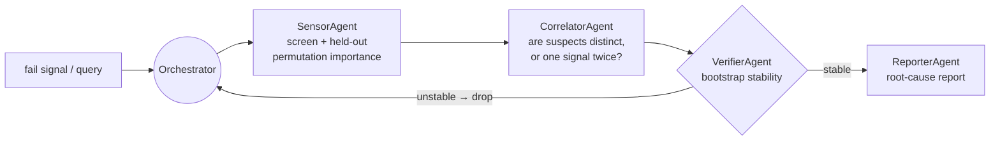

# Yield RCA Agent

**Multi-agent root-cause analysis for semiconductor yield loss, measured
honestly on real fab data.** A plan → execute → verify loop routes
role-specialized agents — attribution, correlation, verification, reporting —
over a fab's process sensors to say *which* signals are implicated in wafer
fail, and how much that answer moves when you resample the wafers.

The interesting part of this repo is not that it produces a root-cause list. It
is that the list is scored against the obvious baseline under a protocol that
cannot flatter it — and that the result is largely negative. That result is
reported here in full rather than buried.

<!-- BEGIN:intro_data -->
The real data is the **UCI SECOM** dataset: 1,567 wafers, 590 process sensors, 104 fails (6.6%, a 1:14 imbalance), 4.5% of cells missing, 90 days of a single campaign. It is evaluated under RepeatedStratifiedKFold(5 splits x 5 repeats, seed 0) = 25 folds, plus a chronological split and a rolling-origin split that never trains on a wafer produced after the one it scores.
<!-- END:intro_data -->



The agents are deterministic tool users, not LLMs. Nothing in this repo calls a
model API; that keeps every number reproducible from a seed, and an LLM
narrating the same tool output would add prose rather than evidence.

<!-- BEGIN:headline -->
- **The AUC KPI is met, by the baseline.** A plain random forest with fold-internal cleaning and median imputation scores **0.759** [0.739, 0.779] ROC-AUC over 25 folds of repeated stratified CV, so the >= 0.75 target is **met** before any agent runs. That is squarely inside the 0.70-0.80 band published for SECOM; anything far above it on this dataset is a leak, not a result.
- **The agent loop does not beat that baseline -- it loses to it.** Same folds, paired per fold: **-0.042 [-0.058, -0.025]** AUC (4 folds better, 21 worse, Wilcoxon p = 6.4e-05). At its pre-registered operating point the loop reaches 0.717 and misses the KPI on its own, and it does not separate from a univariate top-25 selection at the same sparsity (-0.012 [-0.028, +0.004], an interval that includes zero). The plan/verify machinery is not what is buying the number.
- **Sparsity is the price, and it is not negotiable.** Sweeping the loop's settings, AUC tracks how many sensors survive. The leanest configuration whose paired CI still reaches the baseline is `agent_operating_model` at -0.0262 [-0.0524, +0.0000], keeping about 25 sensors -- but that CI only just touches zero, so read it as a boundary case rather than a tie; the leanest *unambiguous* tie keeps about 45. The loop can match a full-sensor forest, but only by declining to be a shortlist -- every setting that returns a list short enough for an engineer to work through is measurably worse.
- **Shuffled CV flatters this dataset.** Train on the earliest 1097 wafers and test on the last 470, and the best baseline falls from 0.759 to **0.532** -- near chance, with every arm collapsing (worst: `hgb_all` at 0.482). Repeating the exercise at every origin -- train on the past, test on the next block of wafers -- puts the best arm at 0.656 (`agent_rf`), so this is not one unlucky split. Over the 90 days of a single campaign the sensor distributions drift, and a shuffled split lets the model interpolate across drift it would never see in production. The KPI is stated against the shuffled protocol, so that is what the scorecard reports -- but the forward-in-time number is the one an engineer should believe.
- **And the drift is measured, not assumed.** Label each wafer by *era* instead of outcome -- early 70% versus late 30% -- and the same pipeline separates the two eras from the sensors alone at **0.993** AUC (0.516 with the era label shuffled). The process data says far more about *when* a wafer was made than about *whether it failed*: 70.7% of sensors shift significantly between the first and last time block, and the fail rate itself runs 3.5% to 14.0% across blocks (chi-square p = 1e-07). On a non-stationary process, "the top 5 causes" is not a fixed quantity measured noisily -- it is a quantity that moves while you measure it.
- **One result points the other way, and it is the weakest one here.** Forward in time the ordering inverts: the best arm across origins is `agent_rf` at 0.656, and the agent loop is +0.071 [-0.072, +0.214] against the full-sensor forest instead of behind it. Selecting fewer sensors plausibly helps precisely when the test distribution has moved. But that interval includes zero over only 4 origins, so it is a hypothesis worth a bigger dataset, not a finding.
<!-- END:headline -->

Full tables, protocol and provenance: [`RESULTS.md`](RESULTS.md). Every figure
in this README and in `RESULTS.md` — and every comparative sentence built
around one — is generated by `scripts/report.py` from the JSON under `runs/`.
`scripts/report.py --check` fails CI if either file drifts from the JSON, so a
stale number cannot survive a commit.

## Two benchmarks, and the line between them

This distinction is the whole reason the results above can be trusted, so it is
stated before any of them:

| | **synthetic** (`demo_smoke.py`, `scripts/eval_synthetic.py`) | **real** (`scripts/eval_secom.py`) |
|---|---|---|
| data | generated: causal sensors planted among correlated decoys | UCI SECOM, as donated |
| ground-truth root causes | **yes, by construction** | **none exist** |
| what can be claimed | held-out AUC, top-5 stability, **and recovery of the planted causes** | held-out AUC and top-5 stability, **and nothing about causes** |

SECOM ships a pass/fail label and a wall of anonymous sensor traces. It does
not ship an answer key, and no amount of attribution machinery creates one. So
"n/5 causal sensors recovered" is a claim this repo makes **only** on synthetic
data, and it is never carried over. A ranked SECOM suspect list is a
*hypothesis for an engineer to go test on the tool*, not a recovered cause.

<!-- BEGIN:kpi -->

<!-- END:kpi -->

<!-- BEGIN:dataset -->
Every count here is measured by `scripts/prepare_data.py`, not quoted from the dataset description:

| property | value |
|---|---|
| wafers x sensors | 1,567 x 590 |
| fails / pass:fail ratio | 104 (6.64%) / 1:14.1 |
| time span | 90 days, timestamps monotone |
| missing cells overall | 4.54% |
| sensors with any missing value | 538 of 590 |
| sensors over 50% missing | 28 |
| worst single sensor | 91.2% missing |
| wafers with at least one missing value | 1,567 of 1,567 (all of them) |
| constant sensors (zero variance) | 116 |
| exact-duplicate sensor groups | 7 covering 104 removable columns |
| sensors surviving the cleaner | 474 of 590 (116 dropped) |
| missing-indicator columns appended | 98 |
| sensors with an \|r\| > 0.99 partner | 179 (370 correlation clusters over 474 kept sensors) |

All 7 exact-duplicate groups turn out to sit *inside* the 116 constant sensors: once those are dropped, 0 exact duplicates remain. Near-duplicates are the real problem -- 179 of the 474 surviving sensors have a partner above |r| = 0.99, which is why the pipeline groups them and why the stability KPI is reported both per sensor and per group.
<!-- END:dataset -->

## Handling the mess, inside the fold

Missing values, constant columns and duplicated sensors are not a preprocessing
footnote on SECOM — they are most of the problem, and the standard way to get a
too-good number is to resolve all three while looking at the whole dataset.
Every such decision here is a `fit` on the training fold:

- **Missing values.** Kept as `NaN` by the loader. Tree arms hand them to
  `HistGradientBoostingClassifier`, which splits on missingness natively; the
  other arms median-impute *per fold*. Because "the metrology step did not
  report" is itself a signal in a fab, `MissingIndicatorAppender` re-attaches a
  0/1 column for every sensor that has missing values in that fold, rather than
  letting the median erase it.
- **Constant columns.** Zero variance over the fold's observed values, so they
  carry nothing and make standardisation ill-posed. Dropped, with the reason
  recorded per column in `SensorCleaner.dropped_`.
- **Duplicated sensors.** Identical values *and* identical NaN pattern within
  the fold; all but the first are dropped. Left in, one physical signal's
  importance is split across several identical names, which corrupts any top-k
  stability measurement before it starts.
- **Near-duplicates.** The harder case, and the common one here: sensors that
  are near-identical without being identical. `CorrelatorAgent` groups them at
  its configured `corr_thresh` and reports one representative per group; the
  stability KPI is then reported both per sensor and per correlation group, at
  the threshold named in that section, so the effect of the choice is visible
  rather than baked in. Counts at each threshold are in the dataset table.

The count of what each rule removes is in the dataset table above, measured by
`scripts/prepare_data.py`.

<!-- BEGIN:secom_auc -->
25 folds, identical for every arm (RepeatedStratifiedKFold(5 splits x 5 repeats, seed 0) = 25 folds). Baseline hyperparameters are chosen by an inner 3-fold grid search on each outer training fold, so no baseline here is the best of a grid scored on the test folds. The delta column is a **paired** per-fold difference against `rf_all`.

| arm | what it is | ROC-AUC (95% CI) | avg precision | paired delta vs `rf_all` | chrono AUC |
|---|---|---|---|---|---|
| `rf_all` | random forest, all sensors (tuned inner-CV) | 0.759 [0.739, 0.779] | 0.210 | -- | 0.532 |
| `univar_top25_rf` | univariate top-25 sensors -> random forest | 0.730 [0.709, 0.750] | 0.200 | -0.029 [-0.041, -0.018] | 0.585 |
| `hgb_all` | hist gradient boosting, all sensors (tuned inner-CV) | 0.721 [0.701, 0.741] | 0.202 | -0.038 [-0.057, -0.019] | 0.482 |
| `agent_rf` | agent loop (RF probe + RF on survivors) | 0.717 [0.699, 0.735] | 0.195 | -0.042 [-0.058, -0.025] | 0.535 |
| `logreg_all` | logistic regression, all sensors (C tuned inner-CV) | 0.687 [0.668, 0.706] | 0.158 | -0.072 [-0.088, -0.056] | 0.559 |
| `agent_logreg` | agent loop (logistic probe + logistic on survivors) | 0.656 [0.637, 0.675] | 0.145 | -0.103 [-0.125, -0.082] | 0.511 |
| `majority` | majority class (DummyClassifier) | 0.500 [0.500, 0.500] | 0.066 | -0.259 [-0.279, -0.239] | 0.500 |

The best arm is `rf_all` at 0.759. A plain random forest with fold-internal cleaning and median imputation reaches **0.759** [0.739, 0.779], so the AUC KPI (>= 0.75) is **met** -- by the baseline, before any agent runs.

The agent loop scores 0.717 [0.699, 0.735] while handing the final classifier 20 sensors on average -- screened from the survivors down to 60 cluster representatives, then cut again by the bootstrap drop. Paired against the baseline that is -0.042 [-0.058, -0.025] AUC (4 folds better, 21 worse, Wilcoxon p = 6.4e-05). That interval excludes zero: **the agent loop does not beat the obvious baseline on SECOM, it loses to it.**

The naive-selection control tells us how much of that is selection per se rather than this particular selector: univariate top-25 into the same forest is -0.029 [-0.041, -0.018] against the baseline, and the agent loop differs from *it* by -0.012 [-0.028, +0.004] -- an interval that straddles zero, so the plan/verify machinery buys no measurable accuracy over ranking each sensor on its own.

The chronological column trains on the earliest 1097 wafers and tests on the last 470 (26 fails). All 6 non-trivial arms score lower there than under shuffled CV; `rf_all` falls from 0.759 to 0.532, and the whole field lands between 0.482 (`hgb_all`) and 0.585 (`univar_top25_rf`). That is close enough to chance to say the plain reading out loud: **forward in time, none of these models has much predictive power on SECOM.** Over the 1567 wafers of a 90-day campaign the sensor distributions drift, and a shuffled split quietly lets the model interpolate across drift it would never see in production. The KPI is stated against the shuffled protocol, so that is what the scorecard scores -- but this column is the one that decides whether the thing is deployable.
<!-- END:secom_auc -->


<!-- BEGIN:rolling -->
One chronological split can be one unlucky fortnight, so the same question is asked at every origin: 5 contiguous time blocks; train on blocks 0..k, test on block k+1, for k = 0..3. This is the only protocol here that answers *would this have worked had we deployed it* -- it never trains on a wafer produced after the one it scores.

| arm | shuffled CV | chrono 70/30 | rolling origin, mean of 4 (95% CI) | per origin |
|---|---|---|---|---|
| `agent_rf` | 0.717 | 0.535 | 0.656 [0.495, 0.816] | 0.563 · 0.721 · 0.762 · 0.576 |
| `univar_top25_rf` | 0.730 | 0.585 | 0.644 [0.399, 0.888] | 0.510 · 0.863 · 0.622 · 0.578 |
| `hgb_all` | 0.721 | 0.482 | 0.597 [0.373, 0.820] | 0.512 · 0.782 · 0.626 · 0.467 |
| `rf_all` | 0.759 | 0.532 | 0.585 [0.349, 0.821] | 0.450 · 0.780 · 0.618 · 0.491 |
| `agent_logreg` | 0.656 | 0.511 | 0.559 [0.367, 0.750] | 0.579 · 0.612 · 0.385 · 0.659 |
| `logreg_all` | 0.687 | 0.559 | 0.513 [0.271, 0.755] | 0.381 · 0.502 · 0.441 · 0.729 |
| `majority` | 0.500 | 0.500 | 0.500 [0.500, 0.500] | 0.500 · 0.500 · 0.500 · 0.500 |

Two things happen at once here, and only one of them is solid.

**Solid: everything degrades.** The best shuffled-CV arm (`rf_all`, 0.759) drops to 0.585 [0.349, 0.821] forward in time, and every arm's rolling-origin CI includes 0.5. Whatever SECOM's shuffled-CV skill is made of, a substantial part of it does not survive being asked to predict the next block of wafers.

**Not solid: the ranking inverts.** Only 9 of the 15 arm pairs keep their shuffled-CV order, and the best arm forward in time is `agent_rf` (0.656, an agent arm) rather than `rf_all`. Paired over the 4 origins, the agent loop is +0.071 [-0.072, +0.214] against the full-sensor forest -- an interval that includes zero, so this is a *suggestion*, not a result. The mechanism is plausible -- a model holding 20 sensors has fewer ways to lean on one that drifts than one holding all 474, so selection should pay off exactly when the test distribution moves -- and that is a reason to test it properly, not to claim it. 4 origins with per-origin AUCs spanning 0.381 to 0.863 cannot settle it.

Test blocks grow from 314 wafers (21 fails) as the training window expands, so individual origins are noisy by construction. The honest summary: SECOM's shuffled-CV numbers are the optimistic ones, a yield predictor trained this way should not be expected to hold for the next month of wafers without retraining, and whether sparse attribution helps under drift is the experiment this dataset is too small to run.
<!-- END:rolling -->


## Is it really drift?

<!-- BEGIN:drift -->
"The sensors drift" is the obvious explanation for the section above, and obvious explanations are exactly the ones that get written into a README without being checked. Three checks, from `scripts/drift.py`:

| check | value | note |
|---|---|---|
| adversarial validation: can the sensors tell you *when* a wafer was made? | 0.993 [0.991, 0.995] | 1097 early vs 470 late wafers |
| the same test with the era label shuffled (control) | 0.516 [0.500, 0.531] | must land at chance, or the row above means nothing |
| sensors whose distribution moved between the first and last time block | 324 of 458 (70.7%) | KS two-sample, Benjamini-Hochberg FDR 0.01 |
| median / p90 / max KS statistic per sensor | 0.205 / 0.434 / 0.791 | 0 = identical distributions, 1 = disjoint |
| fail rate across time blocks | 3.5% to 14.0% | chi-square p = 1.04e-07 |

The adversarial test is the decisive one. Label each wafer by *era* rather than by outcome -- early 70% versus late 30% -- and the same pipeline that struggles to reach 0.75 predicting **failure** separates the two eras at **0.993** [0.991, 0.995] from the sensors alone, against 0.516 for the shuffled control. That is essentially perfect: the process data carries a much stronger signal about *when* a wafer was made than about *whether it failed*. The training and test halves of the chronological split are not two samples of one distribution, and 70.7% of individual sensors confirm it one at a time.

Label drift is also present: the fail rate ranges 3.5% to 14.0% across blocks (chi-square p = 1.04e-07), so part of the forward-in-time collapse is the *prior* moving, not only the features. The two effects are not separable at this sample size, and neither is a modelling problem to be fixed by a better ranker.

This is also the cleanest argument for why the top-5 stability KPI is hard here in a way no ranker fixes. If the sensors themselves are non-stationary over the 90 days, "the top 5 causes" is not a fixed quantity being estimated noisily -- it is a quantity that changes while you estimate it.
<!-- END:drift -->

<!-- BEGIN:sweep -->
The agent loop's structural settings are fixed in advance rather than tuned, which is only defensible if the surface around them is published instead of hidden. Same protocol as above (RepeatedStratifiedKFold(5 x 2, seed 0); identical folds for every row), 10 folds, 12 min:

| arm | attribution | vote k / threshold / cap | sensors selected | ROC-AUC (95% CI) | paired delta vs `rf_all` |
|---|---|---|---|---|---|
| `rf_all` | -- | -- | 472.8 | 0.766 [0.731, 0.801] | -- |
| `agent_no_drop_model` | model | 474 / 0.0 / 474 | 256.4 | 0.763 [0.733, 0.793] | -0.003 [-0.017, +0.011] |
| `agent_loose_model` | model | 100 / 0.15 / 150 | 82.0 | 0.760 [0.729, 0.791] | -0.006 [-0.028, +0.016] |
| `agent_wide_model` | model | 60 / 0.2 / 60 | 55.8 | 0.754 [0.720, 0.788] | -0.012 [-0.031, +0.007] |
| `agent_loose_permutation` | permutation | 100 / 0.15 / 150 | 45.4 | 0.749 [0.713, 0.786] | -0.016 [-0.045, +0.012] |
| `agent_no_drop_permutation` | permutation | 474 / 0.0 / 474 | 160.1 | 0.744 [0.707, 0.781] | -0.022 [-0.049, +0.005] |
| `agent_operating_model` | model | 40 / 0.3 / 25 | 25.0 | 0.740 [0.706, 0.774] | -0.026 [-0.052, +0.000] |
| `agent_wide_permutation` | permutation | 60 / 0.2 / 60 | 32.8 | 0.736 [0.703, 0.770] | -0.029 [-0.058, -0.001] |
| `univar_top25_rf` | -- | -- | 25.0 | 0.729 [0.693, 0.766] | -0.037 [-0.060, -0.013] |
| `agent_operating_permutation` | permutation | 40 / 0.3 / 25 | 20.6 | 0.724 [0.691, 0.757] | -0.042 [-0.072, -0.012] |
| `agent_sparse_model` | model | 20 / 0.5 / 25 | 7.1 | 0.697 [0.664, 0.731] | -0.068 [-0.097, -0.039] |
| `agent_sparse_permutation` | permutation | 20 / 0.5 / 25 | 3.5 | 0.658 [0.631, 0.686] | -0.108 [-0.147, -0.069] |

AUC tracks how many sensors survive, and it does so almost monotonically: 41 of the 45 (sparsity, AUC) pairs are concordant, from 4 sensors at 0.658 up to 256 at 0.763, against 0.766 for using all of them. SECOM's predictive signal is spread thinly over many weak sensors rather than concentrated in a few, so sparsity is not free.

That does not make the loop uniformly worse. 6 of the 10 configurations have a paired CI that reaches the baseline -- `agent_operating_model`, `agent_loose_permutation`, `agent_wide_model`, `agent_loose_model`, `agent_no_drop_permutation`, `agent_no_drop_model` -- and the leanest of those keeps about 25 sensors. **So the loop can match a full-sensor forest, but only by declining to be a shortlist.** Every configuration returning a list short enough for an engineer to work through (4 of them, down to 4 sensors) is measurably worse.

Two caveats on those ties, both in the direction of not over-claiming. 2 of them (`agent_operating_model`, `agent_no_drop_permutation`) have a CI that only just touches zero, which is a boundary case rather than a demonstrated equivalence. And this sweep runs 10 folds where the headline table runs 25, so its intervals are wider and it has *less* power to separate arms -- a tie here is weaker evidence than a tie there. The headline comparison is the one with the folds.

The fairest single comparison in the table is at matched sparsity. `univar_top25_rf` keeps 25 sensors chosen one at a time; `agent_operating_model` keeps 25 chosen by the full loop. Paired over the same folds the loop is +0.010 [-0.004, +0.024] against it -- an interval including zero, so at equal budget the plan/verify machinery is not measurably better than ranking each sensor on its own. That is the comparison the loop most needs to win, and on this data it does not win it decisively either way.

The limit row is the sanity check rather than a result: with the drop step disabled (`stability_min` 0, no cap) `agent_no_drop_model` lands at 0.763, -0.003 [-0.017, +0.011] from the baseline. The wrapper degrades back onto the baseline as it should, so the gap at the operating point is the selection doing damage, not a defect in the plumbing.

One design axis does pay: scoring suspects by the base model's own importance averaged over resamples beats held-out permutation AUC-drop at 5 of the 5 matched depths (mean gap +0.021 AUC). With roughly 25 positives in an inner validation split, the permutation estimate is simply too noisy to rank on, which is the same sample-size story the stability section tells.
<!-- END:sweep -->


<!-- BEGIN:stability -->
The metric was defined in `yieldrca/stability.py` before it was measured, because it has enough degrees of freedom that defining it afterwards would be meaningless. **Primary: mean pairwise top-5 overlap** -- the average, over all pairs of resamples, of |T_b n T_b'| / 5, where T_b is the top 5 of a ranking re-derived from scratch on resample b. It has no reference set, so it cannot be inflated by choosing the reference after the fact. The **consensus** column instead picks the 5 most frequent sensors *after* seeing every resample and averages their selection frequency, which is why it is always the friendlier number. The **cluster** columns map each sensor to its |r| >= 0.99 correlation group first.

Two perturbation schemes, and the choice matters more than any modelling decision below it. `bootstrap` is 200 resamples with replacement -- each sees ~63% of the wafers as unique rows, so two replicates share under half their data. `cv_train` is the 25 training folds of the same repeated CV the AUC table uses -- at 5 folds those are 80% of the data each and share 75% of their rows, a much gentler shake. **Bootstrap is reported as primary** because it is the standard stability-selection perturbation and because a KPI should be scored against the harder of two defensible protocols, not the kinder one.

| ranker | what it ranks by | pairwise (bootstrap) | pairwise, cluster-aware | consensus (bootstrap) | pairwise (CV folds) | pairwise, cluster-aware (CV) |
|---|---|---|---|---|---|---|
| `univariate` | per-sensor \|AUC - 0.5\| | 46.1% | 46.0% | 61.1% | 73.7% | 73.7% |
| `logreg_coef` | \|standardised logistic coefficient\| | 42.6% | 42.6% | 55.9% | 68.8% | 68.8% |
| `rf_impurity` | random-forest impurity importance | 36.5% | 36.6% | 49.7% | 53.0% | 53.0% |
| `perm_only` | SensorAgent only: screen + held-out permutation AUC drop | 20.0% | 20.6% | 32.8% | 34.1% | 34.3% |

A uniformly random ranker scores 1.1% raw (5 of 474 surviving sensors) and 1.4% cluster-aware (5 of 370 clusters), so every row is far clear of chance.
<!-- END:stability -->


<!-- BEGIN:synthetic -->

<!-- END:synthetic -->

## What to actually do with this

The measurements point at one configuration, and it is not the one that scores
best on a slide:

1. **Predict with every sensor — with one asterisk.** Under the shuffled
   protocol selection costs AUC monotonically, because the signal is diffuse,
   so `rf_all` is the model to deploy. The asterisk is that forward in time
   the ordering reverses and the sparse arms come out ahead; that comparison
   has four origins behind it and its interval includes zero, so it is a
   reason to monitor and re-measure as wafers accumulate, not a reason to ship
   the sparse model today.
2. **Report with the loop, and quote its stability.** `AgentRCA.report()`
   returns the ranked survivors with each one's bootstrap re-selection
   frequency. Used this way the loop costs nothing predictive — the AUC is the
   baseline's by construction — and the stability number is what stops the
   report being over-read. `PredictAllReportFew` is exactly this: full-sensor
   prediction, loop-driven reporting, so the recommendation is code rather
   than advice.
3. **Believe the forward-in-time split, not the shuffled one.** For a go/no-go
   decision the shuffled-CV number is the optimistic one, and the drift
   diagnostics say why: era is far more predictable from these sensors than
   failure is. Plan on retraining, and treat any fixed model as having a shelf
   life measured in weeks.
4. **Treat the suspect list as a work order, not a diagnosis.** At this
   stability, the useful output is a shortlist of signal *families* worth an
   engineer's afternoon.

The honest summary of the KPI card: on SECOM this pipeline is a decent
predictor and an unreliable attributor, and the agent loop's contribution is
explanatory rather than predictive.

## Leakage controls

| decision | where it is fitted |
|---|---|
| constant / duplicate sensor detection | `SensorCleaner.fit`, training fold |
| imputation medians | `SimpleImputer` inside the pipeline |
| standardisation | `StandardScaler` inside the pipeline |
| missing-indicator column choice | `MissingIndicatorAppender.fit`, training fold |
| candidate screen | `screen_*`, training fold |
| permutation importance | inner split of the training fold |
| bootstrap verification | resamples of the training fold only |
| baseline hyperparameters | inner-CV `GridSearchCV`, training fold |
| correlation clusters (reporting only) | unlabelled sensor matrix, never used to predict |

`tests/test_real.py::test_permuted_labels_score_at_chance` is the enforcement:
it shuffles the labels, runs the full cross-validation, and asserts every arm
lands near 0.5. Any decision that had escaped the fold would show up there as
skill on noise.

## Quickstart

The offline path needs nothing but numpy:

```bash
pip install -r requirements.txt
python demo_smoke.py                          # synthetic, end-to-end
PYTHONPATH=. python tests/test_smoke.py
```

The real-data path adds pandas / scikit-learn / scipy:

```bash
pip install -r requirements-full.txt
python scripts/prepare_data.py                # unpack secom.zip -> data/
bash scripts/overnight.sh $(which python)     # every experiment, then the report
```

`scripts/overnight.sh` runs on CPU, caps parallelism at 16 workers and pins one
BLAS thread per worker. Individual stages:

```bash
python scripts/eval_secom.py      --repeats 5 --jobs 16   # baselines vs the loop
python scripts/sweep_loop.py      --repeats 2 --jobs 16   # loop sensitivity
python scripts/stability_secom.py --boot 200 --jobs 16    # the top-5 KPI
python scripts/drift.py           --jobs 16               # is it really drift?
python scripts/eval_synthetic.py  --seeds 10 --jobs 10    # ground-truth recovery
python scripts/report.py                                  # RESULTS.md + README
```

Using the loop directly:

```python
from yieldrca.data import load_secom
from yieldrca.estimator import AgentRCA, PredictAllReportFew

X, y, names = load_secom("data")

rca = AgentRCA(base="rf").fit(X, y)      # fit inside your own CV fold
print(rca.report(names))                 # ranked survivors + stability
print(rca.selected_original_)            # sensors that survived the drop
print(rca.ranking())                      # the full reported ranking

# the configuration the results argue for: predict with everything,
# report with the loop
m = PredictAllReportFew().fit(X, y)
m.predict_proba(X)[:, 1]                 # full-sensor forest
print(m.report(names))                   # the loop's suspect list
```

## Layout

```
yieldrca/
  data.py         SECOM loader (+ timestamps) and the synthetic generator
  preprocess.py   SensorCleaner / MissingIndicatorAppender / UnivariateTopK
  attribution.py  held-out permutation importance, screens, correlation groups
  estimator.py    AgentRCA — the loop as an sklearn estimator, plus
                  PredictAllReportFew (predict with all, report with the loop)
  evaluate.py     repeated stratified CV, identical folds, paired deltas
  stability.py    the top-5 stability definition, and its measurement
  agents.py       Sensor / Correlator / Verifier / Reporter (numpy path)
  model.py        numpy logistic regression + tie-correct rank AUC
  pipeline.py     run_rca — the numpy-only orchestrator
scripts/          one script per experiment, each writing a JSON to runs/
                  report.py regenerates RESULTS.md and the README's blocks
                  make_figures.py regenerates assets/*.png
runs/             the JSONs every number in the docs is generated from
assets/           the figures, all drawn from runs/
tests/            test_smoke.py (numpy only) · test_real.py (sklearn path)
```

## Limits

<!-- BEGIN:limits -->
- **No causal ground truth on SECOM**, so nothing here validates the *causal* half of "root-cause analysis" on real data. The synthetic benchmark is a proxy, and its planted structure is additive-logistic, which is kinder than a fab.
- **104 positives.** That is the binding constraint on both KPIs, and no modelling choice in this repo escapes it. Fixing the stability number needs more failed wafers, not a better ranker.
- **Sensors are anonymous.** A surviving suspect cannot be mapped to a tool or a process step, so a domain expert cannot sanity-check the list -- which is exactly the check that would matter most.
- **Permutation importance is not a causal effect.** It measures what a fitted model leans on. Two near-identical sensors split it, and a genuine driver the screen missed never gets scored at all.
- **The stability metric is protocol-sensitive.** Bootstrap and CV-fold resampling disagree by tens of points on the same ranker (see the table), so any "top-5 stability" figure quoted without its perturbation scheme is uninterpretable. This repo reports both and headlines the harder one.
<!-- END:limits -->

MIT licensed.
